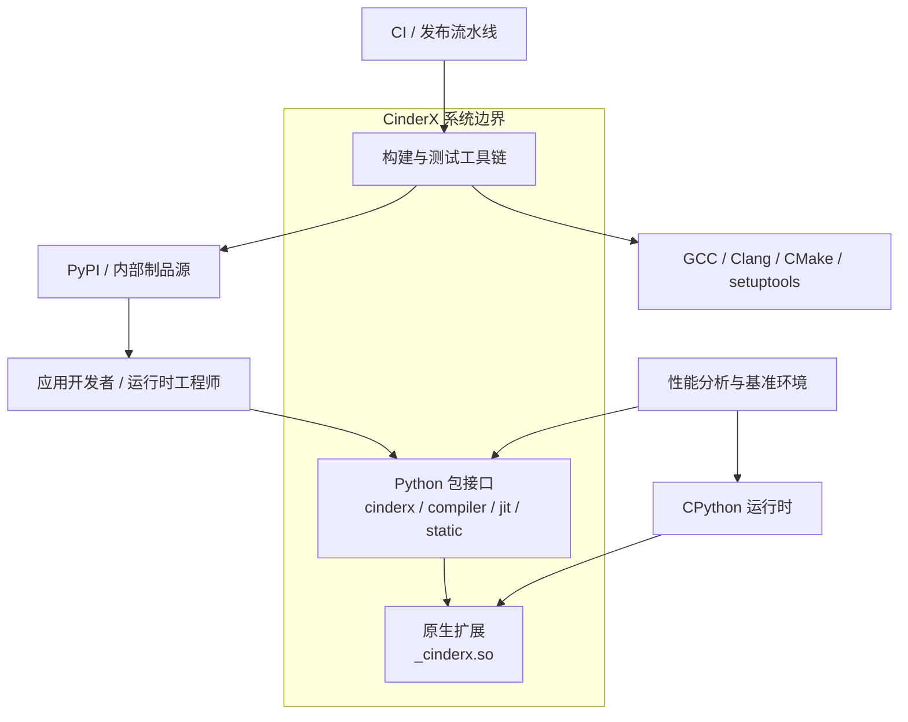
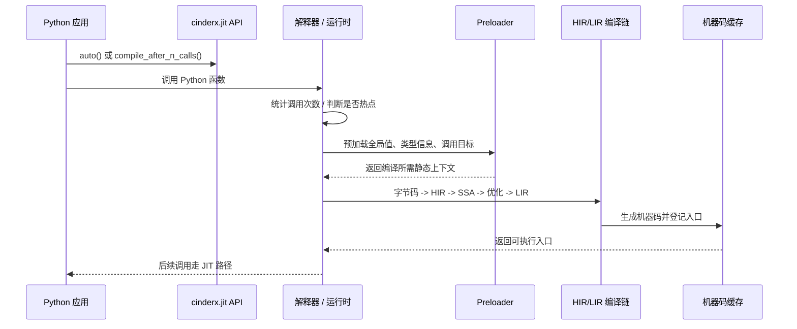
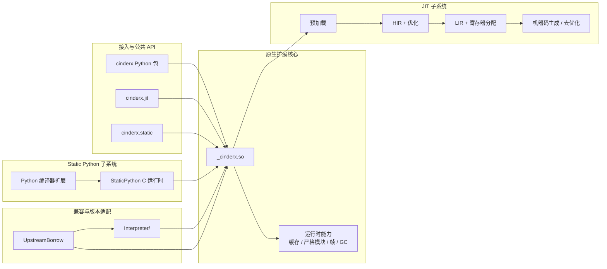
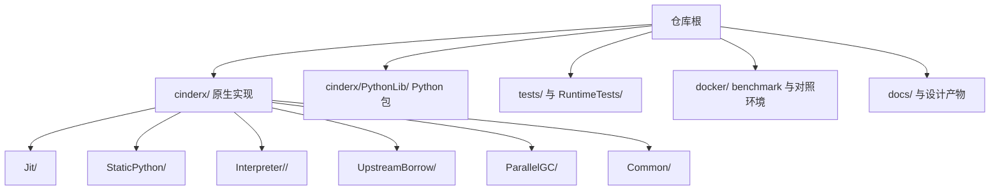
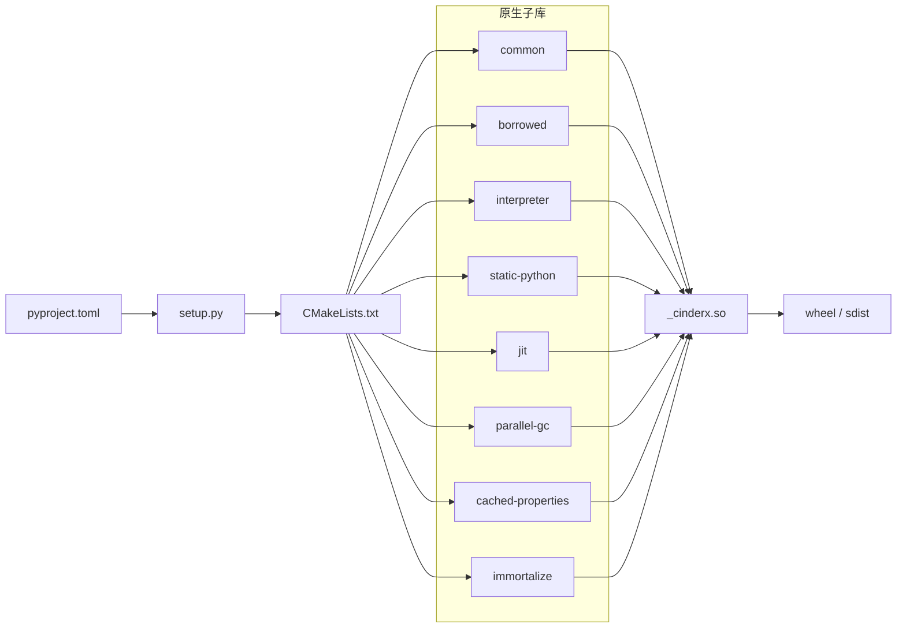
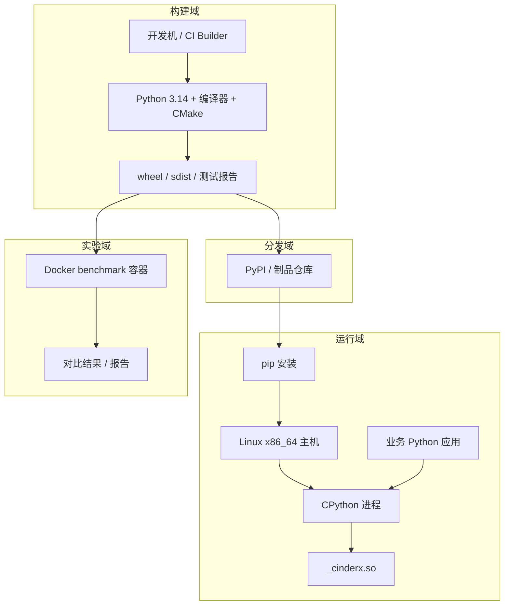
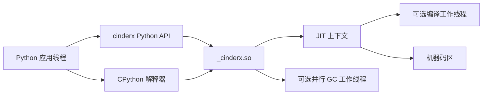
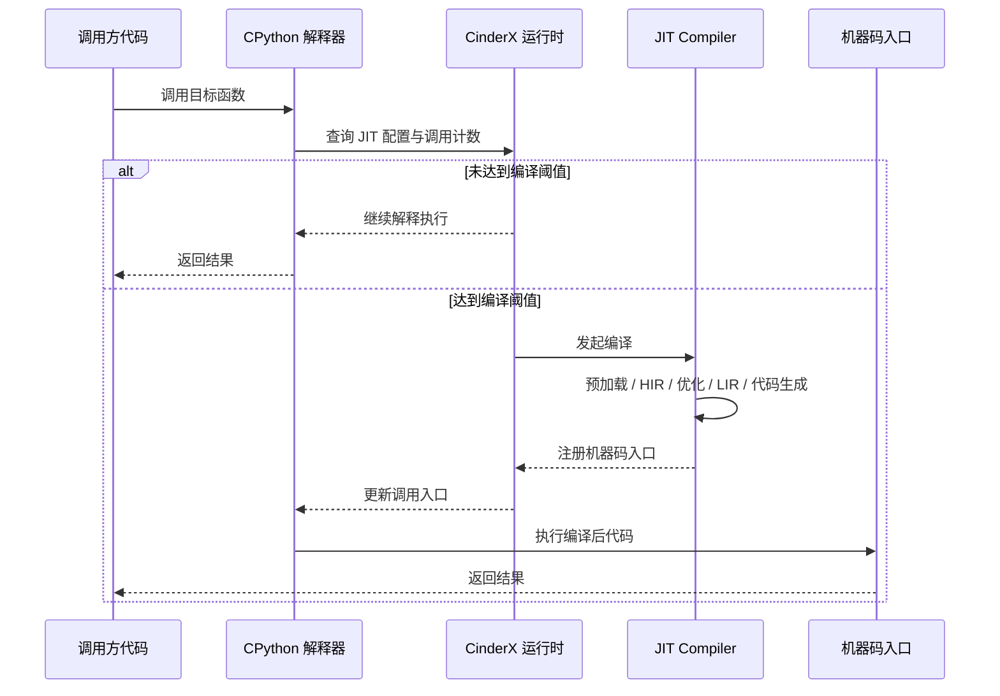
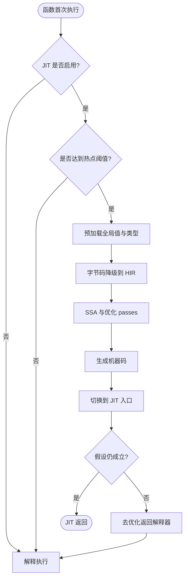

# CinderX 架构设计说明书

副标题: 方案 A - 标准 4+1 规范版

## 1. 文档目的

本文档面向架构评审、研发协作、性能优化和后续维护，采用 4+1 视图方法描述 CinderX 的整体架构。文档以仓库当前实现为依据，尽量与 `docs/design.pdf` 中 4+1 章节的子模型分类保持一致，并将抽象建模语言映射到 CinderX 的真实代码组织、构建链路和运行机制。

本文档的基线不是抽象产品版本，而是当前代码仓的当前分支和当前工作树，具体锚定为：

- 当前分支: `bench-cur-7c361dce`
- 当前基线: 当前工作树可见实现，而不是某个历史 release 截面
- 当前重点: JIT、解释器适配、构建发布、Docker benchmark、ARM/性能实验链路

本文档适用对象包括：

- 运行时与编译器研发工程师
- Python 平台与性能工程师
- 构建发布与 CI 维护人员
- 新加入项目的开发者和评审人员

## 2. 系统概述

CinderX 是一个用于提升 Python 运行时性能的扩展系统。对当前分支而言，它不是静态产品说明中的单一扩展模块，而是一个包含运行时核心、版本适配、构建发布和性能验证链路的复合系统。它不是独立应用，而是以 Python 包和原生扩展的形式嵌入 CPython 进程，提供如下关键能力：

- JIT 编译: 将 Python 字节码编译为本地机器码，加速热点函数执行
- Static Python: 基于类型注解生成更专用的字节码，并与 JIT 协同优化
- 解释器增强: 为多版本 Python 提供专用解释器适配与定制字节码支持
- 运行时增强: 包括轻量帧、并行 GC、缓存属性、严格模块等扩展能力
- 工程化配套: 提供构建、打包、测试、Docker 基准环境及发布配置

从产品形态上看，CinderX 可以被理解为一组协作容器的组合：

- Python 侧 API 与工具包
- 原生扩展 `_cinderx.so`
- JIT 与 Static Python 子系统
- 多 Python 版本兼容层
- 构建、测试与发布工具链

## 3. 架构驱动因素

### 3.1 业务与技术目标

- 在尽量保持 Python 生态兼容性的前提下，显著提升运行时性能
- 通过 JIT 和 Static Python 将热点路径优化为更低成本的机器执行路径
- 支持从实验性研究到生产验证的完整工程流程
- 将运行时优化从 Python 分叉内核中解耦为扩展式交付能力

### 3.2 关键约束

- 外部发行面向 Python 3.14-3.15，且以 Linux x86_64 为主要支持目标
- 多项高级能力受编译开关、平台、Python 版本和运行时补丁条件约束
- 原生扩展必须与 CPython 内部机制保持精细兼容
- JIT 和解释器增强不能破坏 Python 语义正确性
- 构建链路依赖 C/C++ 工具链、CMake、setuptools 以及第三方原生库

### 3.3 利益相关方

| 角色 | 关注点 |
| --- | --- |
| 应用开发者 | API 易用性、兼容性、性能收益 |
| 运行时工程师 | 编译链正确性、去优化机制、跨版本兼容 |
| 编译器工程师 | HIR/LIR 设计、优化 passes、代码生成质量 |
| 发布工程师 | wheel 构建、构建矩阵、可复现交付 |
| 性能工程师 | benchmark 数据、开关控制、实验隔离 |

### 3.4 质量属性优先级

1. 性能
2. 正确性
3. 兼容性
4. 可演进性
5. 可观察性
6. 可构建性

## 4. 4+1 视图总览

根据 `docs/design.pdf` 的定义，4+1 方法由以下五个部分构成：

- 用例视图: 以关键场景驱动和验证其余四个视图
- 逻辑视图: 描述逻辑分解、职责与关系
- 开发视图: 描述代码结构与构建结构
- 部署视图: 描述交付件、安装与部署关系
- 运行视图: 描述运行期交互、进程/线程和关键时序

本文档将 CinderX 的关键场景定义为：

- 场景 S1: Python 应用启用 JIT 并自动编译热点函数
- 场景 S2: 使用 Static Python 编译并执行带类型注解的模块
- 场景 S3: 通过构建系统生成 wheel 并在测试或基准环境中安装验证

## 5. 用例视图

### 5.1 用例视图概述

用例视图作为 "+1" 视图，不单独引入新技术组件，而是用关键场景驱动逻辑、开发、部署和运行四个视图的边界与设计重点。对于 CinderX，用例视图最重要的价值在于把"性能优化系统"转化为可观察、可交付、可验证的具体工程活动。

### 5.2 上下文模型

#### 上下文解释

- 对应用开发者而言，CinderX 首先表现为 Python 包与少量初始化 API
- 对运行时而言，核心载体是 `_cinderx.so` 原生扩展
- 对发布链路而言，CinderX 是可构建、可测试、可打包的 wheel 产物
- 对性能场景而言，CinderX 需要在容器、benchmark 和对照环境中被重复验证

### 5.3 关键用例模型

| 用例编号 | 用例名称 | 主要参与者 | 结果 |
| --- | --- | --- | --- |
| UC-01 | 启用热点函数 JIT | 应用开发者 | 热点函数被编译成本地代码 |
| UC-02 | 编译 Static Python 模块 | 运行时工程师 | 生成专用字节码并在运行时利用更多类型信息 |
| UC-03 | 构建和发布 wheel | 发布工程师 | 输出可安装的 wheel/sdist 工件 |
| UC-04 | 执行基准与回归验证 | 性能工程师 | 获取性能对照结果和实验报告 |
| UC-05 | 关闭或降级高级能力 | 维护工程师 | 在不支持环境下回退到兼容模式 |

### 5.4 架构重要场景

#### S1: 启用 JIT 并自动编译热点函数

#### S2: 编译并执行 Static Python 模块

- 输入是带有类型注解的 Python 模块
- Python 编译器扩展尝试在编译期识别类型与操作语义
- 产物是更专用的字节码，如 `LOAD_FIELD` 一类操作
- JIT 在看到这些专用字节码时进行进一步优化
- 若静态信息不足，则回退到普通 Python 行为

#### S3: 构建并交付 wheel

- `pyproject.toml` 定义构建后端和 wheel 构建矩阵
- `setup.py` 负责编译器选择、特性开关、PGO/LTO 协调
- `CMakeLists.txt` 负责编排原生子库与 `_cinderx.so` 链接
- 发布结果以 wheel 为主，同时保留 Docker 与基准环境用于验证

## 6. 逻辑视图

### 6.1 逻辑视图概述

逻辑视图用于回答"CinderX 在概念上由哪些职责域组成，这些职责如何协作"。对照 `docs/design.pdf` 中的逻辑模型、数据模型、领域模型、功能模型和技术模型，本文将它们分别映射到运行时扩展、编译链、版本兼容层和工程化支撑。

### 6.2 逻辑模型

### 6.3 领域模型

| 领域对象 | 职责 |
| --- | --- |
| Python 函数 / 模块 | 被解释、被统计、被编译、被运行的基本对象 |
| PyCodeObject / 字节码 | JIT 与 Static Python 的输入中间表示 |
| HIR / LIR | JIT 编译流程中的核心中间表示 |
| 原生代码块 | JIT 输出的可执行机器码 |
| 构建工件 | 静态库、共享库、wheel、Docker 环境和 benchmark 结果 |
| 版本适配模板 | 针对 3.12 / 3.14 / 3.15 的解释器和 borrowed 代码模板 |

### 6.4 数据模型

对于 CinderX，数据模型不是传统业务数据库，而是运行时和构建期工件的数据流模型：

| 数据对象 | 来源 | 去向 |
| --- | --- | --- |
| Python 源码 | 应用代码 / 测试 | 编译器、解释器 |
| 普通字节码 | CPython 编译结果 | JIT HIR Builder |
| Static Python 专用字节码 | CinderX 编译器 | JIT 与解释器 |
| 预加载上下文 | 模块全局值、类型信息 | JIT 编译流程 |
| HIR / LIR 图 | JIT lowering 与优化 | 代码生成器 |
| 原生机器码 | asmjit 代码生成 | 运行时调用入口 |
| wheel / sdist | 构建系统 | pip 安装、容器验证 |

### 6.5 功能模型

逻辑上，CinderX 可拆为以下功能域：

1. API 接入域
   - 暴露 `cinderx.jit`、`cinderx.static` 等公共能力
   - 屏蔽底层原生扩展细节

2. 运行时扩展域
   - 挂接缓存、严格模块、轻量帧、并行 GC 等运行时增强
   - 负责原生层与 Python 对象模型交互

3. JIT 编译域
   - 预加载、HIR 构建、优化、LIR 降级、机器码生成、去优化

4. Static Python 域
   - 提供静态字节码编译、专用 opcode、类型约束辅助能力

5. 版本兼容域
   - 维护多 Python 版本解释器与 borrowed 代码差异

6. 工程化域
   - 构建、测试、容器基准、发布矩阵和实验配置

### 6.6 技术模型

| 技术点 | 在系统中的作用 |
| --- | --- |
| Python + setuptools | Python 包构建、扩展编译入口 |
| CMake | 原生子库编排和链接 |
| C/C++20 | 原生运行时、JIT、兼容层主体实现 |
| asmjit | 机器码生成 |
| fmt | 原生日志和格式化支持 |
| Zlib / 其他依赖 | 原生依赖支持 |
| Docker / compose | 实验性 benchmark 环境 |
| cibuildwheel | wheel 构建矩阵与交付 |

### 6.7 逻辑视图结论

从逻辑上，CinderX 不是单一 JIT 库，而是一组围绕"高性能 Python 运行时扩展"目标协作的子系统。其核心逻辑边界是：

- 外层 Python API
- 中间原生扩展与运行时能力
- 内层编译与解释器协同能力
- 旁路的版本兼容与工程化支撑

## 7. 开发视图

### 7.1 开发视图概述

开发视图对应 `docs/design.pdf` 中的代码模型和构建模型。它回答两个问题：

- 代码在仓库中如何分解
- 这些分解如何被构建系统组织为最终交付件

### 7.2 代码模型

### 7.3 代码结构说明

| 目录 / 模块 | 角色 |
| --- | --- |
| `cinderx/Jit/` | JIT 主体，包括 HIR、LIR、代码生成、去优化 |
| `cinderx/StaticPython/` | 静态类型相关运行时与辅助能力 |
| `cinderx/Interpreter/<version>/` | 针对不同 Python 版本的解释器适配层 |
| `cinderx/UpstreamBorrow/` | 从上游 CPython 借用内部实现的自动化机制 |
| `cinderx/PythonLib/cinderx/` | Python 侧入口、JIT API、Static Python API、编译器 |
| `cinderx/ParallelGC/` | 并行 GC 功能模块 |
| `docker/` | wheel 验证、基准、对照测试容器环境 |
| `tests/` | Python 层验证 |

### 7.4 构建模型

### 7.5 构建与发布特征

- `pyproject.toml` 使用 `setuptools.build_meta`
- `setup.py` 负责版本号、编译器选择、特性开关和 PGO/LTO 阶段化构建
- `CMakeLists.txt` 负责原生库拆分、依赖获取和 `_cinderx.so` 链接
- 发布矩阵通过 `cibuildwheel` 定义 manylinux 与 musllinux 目标

### 7.6 开发视图结论

开发视图呈现出明显的"产品线式组织"特征：

- 同一逻辑能力对应多个 Python 版本实现
- 公共能力下沉到 `Common/` 和 `UpstreamBorrow/`
- 构建系统将多模块静态/共享链接为单一扩展载体
- Python 入口层与原生层分离，使调用方式稳定而实现可演进

## 8. 部署视图

### 8.1 部署视图概述

部署视图对应 PDF 中的交付模型和部署模型。由于 CinderX 是扩展库而不是独立服务，部署视图的重点不在服务网格，而在于"工件如何交付、安装到什么环境、以什么方式被宿主 Python 进程加载"。

### 8.2 交付模型

| 交付件 | 说明 |
| --- | --- |
| wheel | 面向终端安装的主要交付格式 |
| sdist | 源码分发包 |
| `_cinderx.so` | wheel 中的关键原生扩展 |
| Python 包文件 | `cinderx`、编译器、JIT API 等 Python 侧代码 |
| Docker 测试环境 | 用于实验、基准、对照验证 |
| benchmark 结果 | 性能回归与实验比较产物 |

### 8.3 部署模型

### 8.4 部署约束与说明

- 主要目标平台为 Linux x86_64
- macOS 可构建但大部分高级能力受限
- Windows 当前不支持
- ARM 相关能力在仓库中已有实验性脚本与基准环境，但不等同于当前主要外部交付目标
- 运行时部署不是独立守护进程，而是以共享库形式嵌入 Python 进程

### 8.5 部署视图结论

CinderX 的部署模型本质上是"库型产品部署模型"：

- 构建域负责生成二进制工件
- 分发域负责存储与传播工件
- 运行域通过 `pip install` 将扩展注入宿主解释器
- 实验域用于验证性能收益与回归

## 9. 运行视图

### 9.1 运行视图概述

运行视图描述系统启动过程、运行期交互和关键时序。对于 CinderX，运行视图应重点回答：

- Python 进程何时加载 CinderX
- 函数如何从解释执行切换到 JIT 执行
- Static Python 如何影响运行时行为
- 去优化、并发编译和可选 GC 能力如何参与运行

### 9.2 运行模型

### 9.3 运行模型 - 关键交互顺序图

### 9.4 运行模型 - Static Python 路径

- 编译期使用类型注解生成专用 opcode
- 运行期由解释器与 JIT 识别这些专用 opcode
- 热点路径被进一步编译成更紧凑的机器指令
- 当类型条件不满足或信息不足时回退到动态 Python 语义

### 9.5 运行模型 - 去优化与回退

- JIT 使用去优化机制将执行从机器码切回解释器
- 去优化用于处理罕见慢路径、假设失效或调试场景
- 系统保留显式启停、抑制、去优化和批量预编译控制接口

### 9.6 运行模型 - 活动流

### 9.7 运行视图结论

运行视图的核心架构思想是"解释执行与机器执行的协同"：

- 解释器负责安全、通用的基线执行
- JIT 负责热点路径优化
- Static Python 负责提供更强的类型先验
- 去优化负责维持语义正确性
- 可选并发能力负责提升吞吐与运行时效率

## 10. 横切关注点

### 10.1 兼容性策略

- Python 版本差异通过 `Interpreter/<version>` 和 `UpstreamBorrow` 吸收
- 不支持环境下，Python 层 API 尽量提供退化但不崩溃的行为
- 原生扩展导入逻辑在 Python 层显式判断平台、版本和禁用标志

### 10.2 性能策略

- 通过热点编译和静态字节码提升关键路径效率
- 通过 HIR/LIR 分层优化提升代码生成质量
- 通过 PGO/LTO 和 benchmark 环境支撑持续性能演进

### 10.3 可观察性策略

- 提供编译统计、运行时统计、inline cache 统计等能力
- 支持 JIT dump、汇编输出、性能依赖预热等调试接口
- 保留 benchmark 与实验容器用于结果复现

### 10.4 正确性策略

- 去优化路径保障假设失效时的语义回退
- 编译期预加载避免编译线程中触发不可控 Python 执行
- 构建期与运行期开关将实验能力与稳定能力进行隔离

## 11. 架构权衡与风险

### 11.1 主要权衡

- 更高性能 vs 更复杂的解释器与运行时耦合
- 多版本适配能力 vs 代码维护成本
- 原生优化深度 vs 平台兼容范围
- 工程化实验灵活性 vs 统一发布路径的简单性

### 11.2 主要风险

- 多 Python 版本适配带来长期维护负担
- 借用上游代码与手工解释器覆盖组合增加一致性风险
- 部分能力受平台和内核前提限制，外部用户体验可能不一致
- 高级优化路径的诊断成本高于普通 Python 扩展

### 11.3 风险缓解建议

- 继续保持版本差异在独立目录中局部化
- 强化构建矩阵和关键基准场景的自动回归
- 在文档中明确"支持能力"与"实验能力"边界
- 保持 Python API 退化路径稳定，降低不支持环境的接入成本

## 12. 结论

从 4+1 视角看，CinderX 是一个以性能为首要目标、以正确性为底线、以多版本兼容和工程化验证为支撑的 Python 运行时扩展平台。它的核心不是单一 JIT 编译器，而是由：

- 用例驱动的性能场景
- 分层清晰的逻辑职责
- 面向多版本的开发结构
- 面向工件交付的部署模型
- 面向热点编译与回退的运行模型

共同组成的架构体系。

如果该方案被选为基线版本，后续建议继续补充两类附件：

- 面向评审的 ADR 决策记录
- 面向维护的模块级组件图和时序图细化稿
