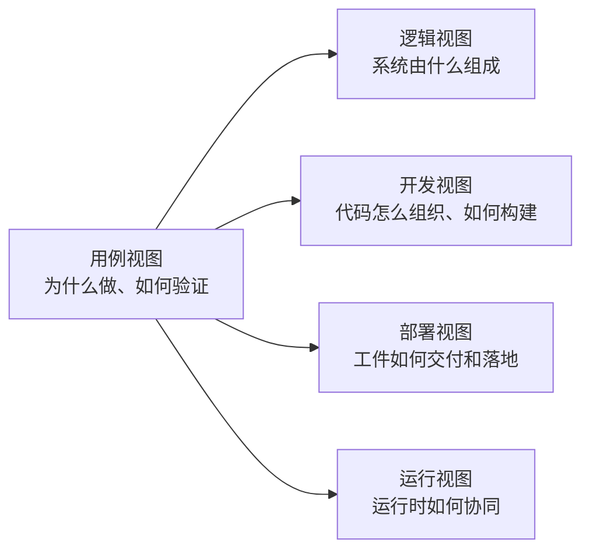
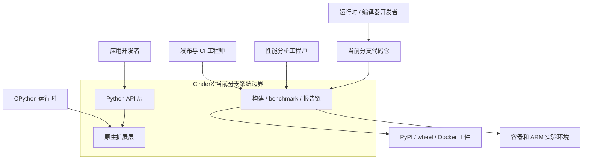
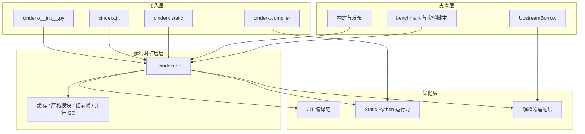
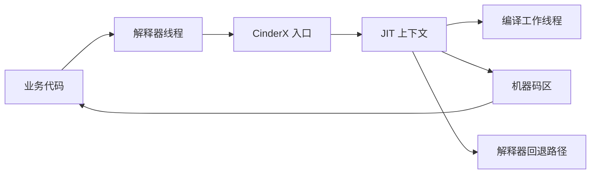
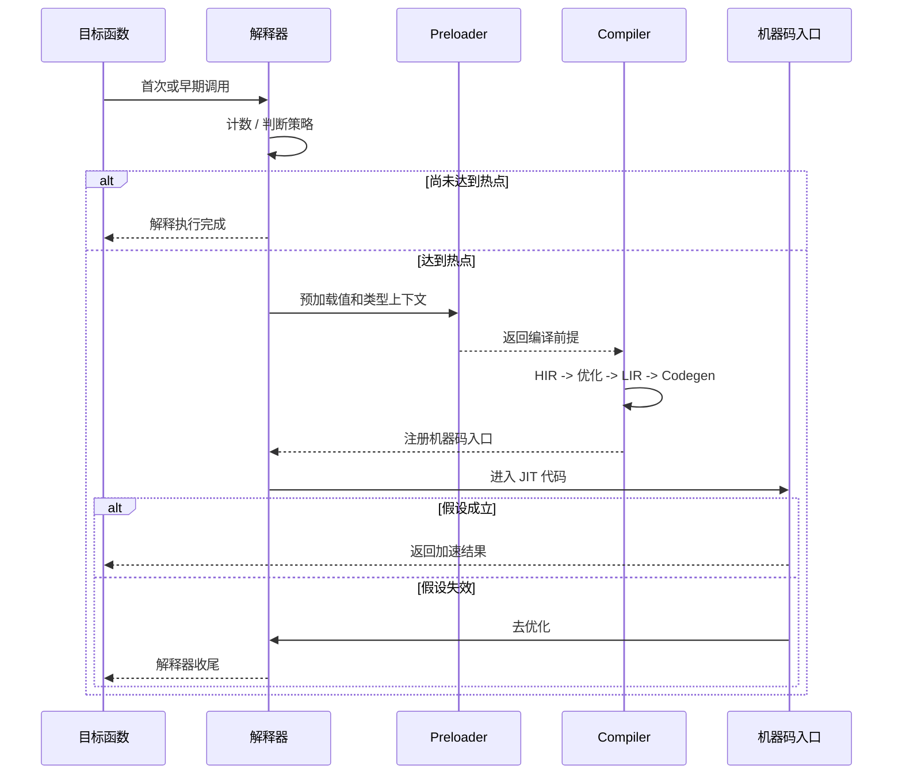
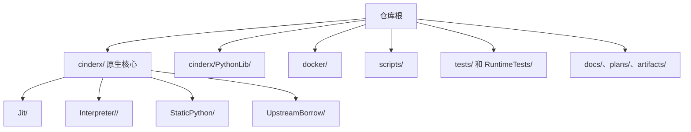
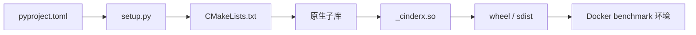
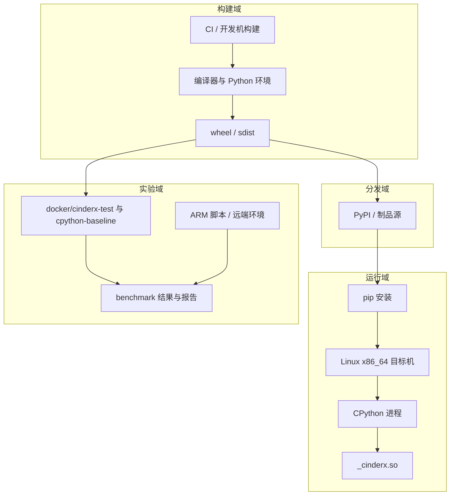

# CinderX 当前分支架构设计说明书

副标题: 方案 B - 场景驱动与分支落地手册版

## 0. 适用范围与基线

本文档不是针对抽象意义上的 CinderX 产品线，而是针对当前代码仓、当前工作树、当前分支 `bench-cur-7c361dce` 的架构说明书。

这意味着本文档有三个显式立场：

- 以当前分支的实现组织、构建方式、性能实验链路和测试布局为准
- 将 CinderX 视为一个正在演进中的性能工程分支，而不是冻结的发布快照
- 既描述稳定骨架，也描述当前分支真正活跃的架构热点

结合当前工作树可以观察到，本分支的活跃面主要集中在以下区域：

- JIT、HIR/LIR 与代码生成链
- 多 Python 版本解释器适配，尤其是 3.14 / 3.15 路径
- Static Python、轻量帧和并行 GC 相关能力
- `setup.py`、`CMakeLists.txt`、`pyproject.toml` 驱动的构建发布链
- Docker benchmark、ARM 实验脚本、性能报告与回归工件

因此，本文档会把"当前分支为何这样组织"和"这条分支现在把复杂度压在哪些地方"写得比传统规格说明更直白。

## 1. 执行摘要

在当前分支中，CinderX 可以被理解为一个"性能导向的 Python 运行时扩展工作台"。它同时承担三类职责：

1. 作为产品能力
   - 向 Python 应用暴露 JIT、Static Python 和运行时增强能力

2. 作为编译与运行平台
   - 将 Python 字节码、静态字节码、JIT 中间表示和机器码串成一条完整执行链

3. 作为性能实验基础设施
   - 提供构建矩阵、Docker benchmark、ARM 脚本、对照测试和工件沉淀

从当前分支的代码和文档布局来看，这不是单纯的扩展模块仓库，而是一个把"运行时优化"、"解释器适配"、"性能验证"三件事放在同一仓里协同推进的工程体系。

## 2. 架构原则

### 2.1 原则一: 性能收益必须有工程化闭环

本分支不是只做局部优化 patch，而是尽量让每个性能改动都能映射到：

- 可编译的实现
- 可验证的 benchmark
- 可回归的测试
- 可沉淀的报告或计划文档

### 2.2 原则二: 正确性优先于激进优化

JIT、Static Python 和解释器增强都建立在 Python 语义不被破坏的前提上。热点路径可以激进优化，但必须保留回退、去优化和禁用路径。

### 2.3 原则三: 版本差异局部化

当前分支通过 `Interpreter/<version>` 与 `UpstreamBorrow` 吸收 Python 内部差异，避免把版本分支条件散落到所有模块。

### 2.4 原则四: 产品交付与实验链路并存

同一仓库既服务于 wheel 交付，也服务于 Docker benchmark、ARM 测试和实验脚本。架构上必须允许"稳定交付路径"和"实验验证路径"并行存在。

## 3. 4+1 视图导航



在本分支里，"+1" 的用例视图尤其重要，因为它直接决定我们该优先描述：

- JIT 热点编译路径
- Static Python 类型驱动路径
- 构建、发布、实验验证路径

## 4. 用例视图

### 4.1 上下文模型



### 4.2 用例模型

本分支最重要的五个架构用例如下：

| 编号 | 用例 | 说明 |
| --- | --- | --- |
| U1 | 热点函数自动 JIT 编译 | 面向真实业务路径的运行时加速 |
| U2 | Static Python 模块执行 | 利用类型信息获得更高优化空间 |
| U3 | Wheel 构建和发布 | 面向可安装产物的稳定交付 |
| U4 | Docker / ARM benchmark 验证 | 面向优化收益验证的实验闭环 |
| U5 | 不支持环境下的退化运行 | 面向兼容性和调试可控性 |

### 4.3 架构重要场景

#### 场景 B1: 业务代码启用 JIT

- 应用侧调用 `cinderx.jit.auto()` 或设置阈值编译
- 解释器先执行基线路径
- 热点函数被预加载、降级为 HIR、优化、生成机器码
- 后续调用跳转到机器码入口
- 假设失效时再回退解释器

#### 场景 B2: 类型注解驱动的 Static Python 执行

- Python 模块进入 CinderX 编译器路径
- 已知类型被编译成更专用的 opcode
- JIT 进一步识别和优化这些 opcode
- 未知类型或动态路径保持 Python 原语义

#### 场景 B3: 当前分支做性能验证

- 构建系统产出 wheel
- Docker 环境或实验脚本加载 wheel
- benchmark 执行并输出对比结果
- 结果进入 `artifacts/`、`docs/plans/`、`docs/superpowers/` 等区域沉淀

## 5. 逻辑视图

### 5.1 逻辑模型

如果用一句话概括当前分支的逻辑结构，可以说：

> 外层是 Python API 和编译器入口，中层是 `_cinderx.so` 运行时扩展，内层是 JIT / Static Python / 解释器适配等高复杂度子系统，旁侧再挂接构建与实验基础设施。



### 5.2 逻辑模型分解

#### A. 接入层

这一层面向使用者，目标是让复杂运行时能力表现为相对稳定的 Python API。

- `cinderx/__init__.py` 负责原生扩展导入和兼容降级
- `cinderx.jit` 提供启停、阈值、统计、预编译等入口
- `cinderx.static` 暴露 Static Python 相关原语和常量
- `cinderx.compiler` 承担 Python 侧编译器扩展能力

#### B. 运行时扩展层

这一层是 Python 与 C/C++ 能力的汇合点，由 `_cinderx.so` 对外承载。它既是功能入口，也是子系统汇聚点。

它对上承接 Python 调用，对下连接：

- JIT 上下文和执行入口
- Static Python 运行时原语
- 缓存、模块补丁、帧、GC 等增强能力

#### C. 优化层

这是当前分支最复杂、最活跃的区域。

- JIT: 包含 preload、HIR、LIR、代码生成、去优化、inline cache
- Static Python: 包含类加载、类型系统、专用容器、专用操作码支持
- 解释器适配: 面向不同 Python 版本维护 CinderX 字节码和解释器覆盖点

#### D. 支撑层

当前分支不是纯运行时代码分支，支撑层在架构上同样重要：

- `UpstreamBorrow` 降低直接复制 CPython 内部代码的维护成本
- 构建系统把复杂原生模块组织成可交付工件
- benchmark 与实验脚本让优化路径有验证闭环

### 5.3 数据模型

当前分支最值得关注的数据对象不是数据库实体，而是运行时与构建期工件：

| 数据对象 | 为什么重要 |
| --- | --- |
| Python 源码 | 是解释器与编译器共同入口 |
| 普通字节码 / 静态字节码 | 决定优化空间和执行路径 |
| HIR / LIR | 是 JIT 设计质量的核心中间层 |
| 原生机器码 | 是性能收益的直接载体 |
| 构建产物 | 决定能否稳定交付和复现 |
| benchmark 结果 | 决定优化是否真正成立 |

### 5.4 功能模型

从功能上看，本分支可以划分为六个功能群：

1. 初始化与能力暴露
2. 字节码与类型驱动优化
3. JIT 编译和执行切换
4. 版本兼容与解释器覆盖
5. 构建、发布、打包
6. benchmark、实验和回归验证

### 5.5 技术模型

当前分支的技术组合体现出"Python 外壳 + 原生核心 + 实验基础设施"的特点：

- Python 负责 API 和编译器前端
- C/C++20 负责核心运行时和 JIT
- asmjit 负责机器码生成
- CMake / setuptools / cibuildwheel 负责构建和分发
- Docker / 脚本 / artifacts 负责实验和验证

## 6. 运行视图

### 6.1 运行模型



### 6.2 运行模型 - 时序重点



### 6.3 运行模型 - 当前分支关注点

当前分支的运行视图有几个明显热点：

- HIR 和 LIR 优化 pass 正在持续演进
- 3.14 / 3.15 解释器路径正在保持同步
- 轻量帧、Adaptive Static Python、并行 GC 等能力受版本和平台影响
- benchmark 与实际优化结果之间的闭环被显著强化

### 6.4 活动图视角

```mermaid
flowchart TD
    start([导入 cinderx]) --> supported{运行时受支持?}
    supported -->|否| degrade[使用降级路径]
    supported -->|是| init[加载 _cinderx.so]
    init --> config[读取特性开关与策略]
    config --> call[执行 Python 函数]
    call --> hot{函数是否进入热点?}
    hot -->|否| interp[继续解释执行]
    hot -->|是| compile[触发 JIT 编译]
    compile --> exec[切换到机器码执行]
    exec --> verify{运行时假设是否成立?}
    verify -->|是| finish([返回结果])
    verify -->|否| deopt[去优化回退]
    deopt --> interp
```

## 7. 开发视图

### 7.1 代码模型

当前分支的开发视图有一个很鲜明的特点: 代码不是按单一层次拆分，而是按"职责域 + Python 版本 + 实验链路"三条维度交叉组织。



### 7.2 当前分支的活跃开发区域

从工作树改动面看，当前分支可以近似理解为三条并行子战线：

1. 运行时与 JIT 主战线
   - `cinderx/Jit/`
   - `cinderx/Interpreter/`
   - `cinderx/StaticPython/`

2. 构建发布战线
   - `setup.py`
   - `CMakeLists.txt`
   - `pyproject.toml`
   - workflow 与 docker 配置

3. 性能验证战线
   - `docker/`
   - `scripts/arm/`
   - `scripts/bench/`
   - `artifacts/`
   - `docs/plans/` 和 `docs/superpowers/`

### 7.3 构建模型



### 7.4 开发视图结论

这一分支的开发视图不是典型的"库代码 + 少量测试"形态，而是：

- 运行时内核
- 解释器适配
- 构建发布
- benchmark 实验
- 设计文档沉淀

共同构成的复合型工程仓。

## 8. 部署视图

### 8.1 交付模型

对当前分支而言，交付不只是一份 wheel，还包括实验和对照环境。

| 类型 | 工件 |
| --- | --- |
| 正式交付 | wheel、sdist |
| 运行载体 | `_cinderx.so`、Python 包 |
| 验证交付 | Docker 环境、benchmark 脚本 |
| 结果交付 | artifacts、reports、plans |

### 8.2 部署模型



### 8.3 当前分支部署特征

- 主交付仍然是面向宿主 Python 进程的扩展库
- Docker 和 ARM 环境不是附属材料，而是架构验证闭环的一部分
- 当前分支对部署的关注点不仅是"能装上"，还包括"能做性能对照"

## 9. 质量属性与架构策略

### 9.1 性能

- 热点编译
- Static Python 专用 opcode
- HIR / LIR 分层优化
- PGO / LTO 构建强化

### 9.2 正确性

- 去优化回退
- 编译前预加载
- 禁用与降级路径
- 多测试层验证

### 9.3 可演进性

- 版本适配局部化
- Python API 与原生核心分层
- plans / reports / artifacts 沉淀为演进上下文

### 9.4 可交付性

- wheel 构建矩阵
- Docker 环境复现
- benchmark 结果可追踪

## 10. 当前分支的架构热点与建议

### 10.1 当前热点

结合工作树和近几次提交，可以把本分支的架构热点归纳为：

- JIT 编译路径仍是核心复杂度中心
- 解释器 3.14 / 3.15 适配是版本兼容中心
- benchmark / ARM / Docker 链路是验证中心
- 大量计划文档和报告表明分支处于持续优化状态，而非冻结状态

### 10.2 对说明书使用者的建议

如果你要用这份方案做评审或选型，建议按下面顺序阅读：

1. 先看用例视图，确认你要讨论的是产品交付、性能优化还是实验验证
2. 再看逻辑视图，理解系统边界和复杂度落点
3. 然后看运行视图，理解真正决定性能与正确性的路径
4. 最后看开发与部署视图，评估团队维护成本和验证闭环

### 10.3 适合作为当前分支基线的结论

如果你希望挑一份更适合"当前分支协作"的说明书，这个方案的价值在于：

- 它明确承认当前分支是性能工程分支，而不是静态产品说明
- 它把 4+1 视图和当前工作树热点绑在一起
- 它更适合用在分支内沟通、评审、继续拆任务和补设计

## 11. 结语

对 `bench-cur-7c361dce` 来说，最重要的架构事实不是"CinderX 有 JIT"，而是：

- JIT、解释器、Static Python、构建和 benchmark 被放在同一条工程闭环里
- 当前分支的复杂度主要集中在运行时优化与验证基础设施
- 4+1 视图依然成立，但必须按当前分支的活跃面去解读

因此，这份方案更像一份"当前分支架构作战地图"。如果你后面要继续做分支内设计评审、拆模块职责、补充更细的时序图和组件图，这一版会更顺手。
