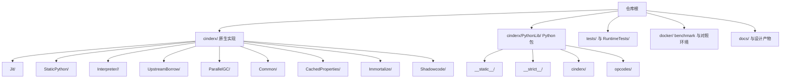
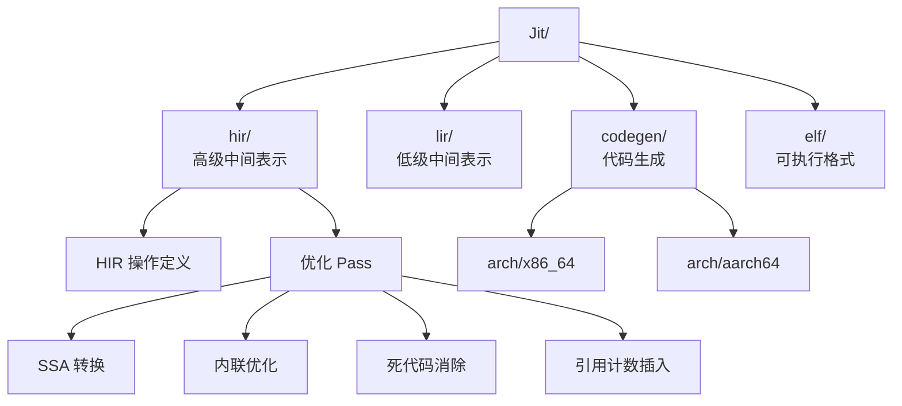
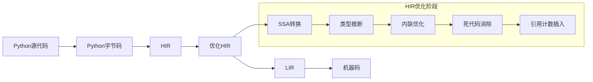
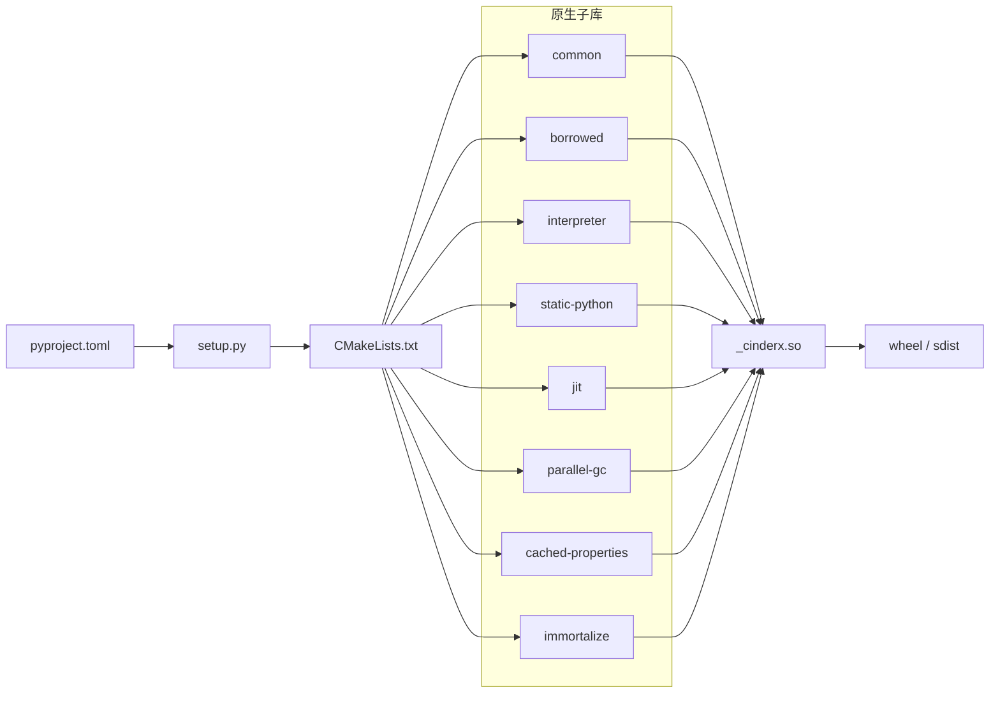
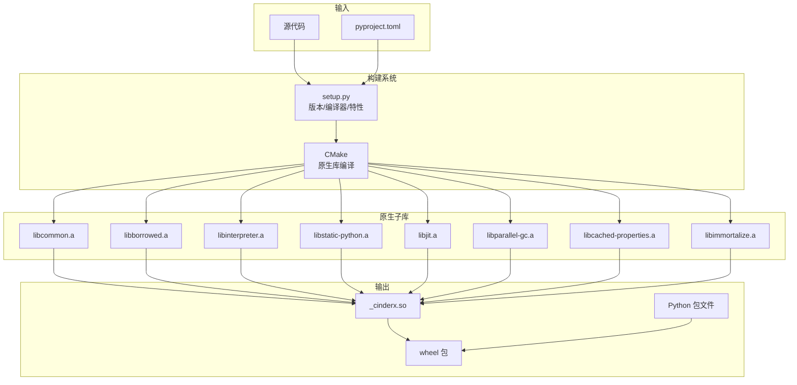

# CinderX 开发视图 - 代码模型图

## 概述

本文档描述 CinderX 项目的代码模型，展示代码在仓库中如何分解，以及这些分解如何被构建系统组织为最终交付件。

## 代码模型图



## 代码结构说明

| 目录 / 模块 | 角色 |
| --- | --- |
| `cinderx/Jit/` | JIT 主体，包括 HIR、LIR、代码生成、去优化 |
| `cinderx/StaticPython/` | 静态类型相关运行时与辅助能力 |
| `cinderx/Interpreter/<version>/` | 针对不同 Python 版本的解释器适配层 |
| `cinderx/UpstreamBorrow/` | 从上游 CPython 借用内部实现的自动化机制 |
| `cinderx/PythonLib/cinderx/` | Python 侧入口、JIT API、Static Python API、编译器 |
| `cinderx/ParallelGC/` | 并行 GC 功能模块 |
| `cinderx/Common/` | 跨模块共享的基础代码（引用计数、类型工具、日志等） |
| `cinderx/CachedProperties/` | 缓存属性实现 |
| `cinderx/Immortalize/` | 对象不朽化支持 |
| `cinderx/Shadowcode/` | 影子代码管理 |
| `cinderx/PythonLib/__static__/` | 静态 Python 编译器支持 |
| `cinderx/PythonLib/__strict__/` | 严格模式支持 |
| `cinderx/PythonLib/opcodes/` | 多版本操作码定义 (3.10/3.12/3.14/3.15) |
| `docker/` | wheel 验证、基准、对照测试容器环境 |
| `RuntimeTests/` | C++ 级别的单元测试和集成测试 |
| `docs/` | 设计文档与架构说明 |

## JIT 内部结构



## 编译流水线



## 关键依赖关系

### JIT编译依赖链
```
PythonLib.cinderx.jit
    ↓
Jit.pyjit (入口)
    ↓
Jit.compiler (编译器)
    ↓
Jit.hir.builder (HIR构建)
    ↓
Jit.hir.* (HIR优化)
    ↓
Jit.lir.generator (LIR生成)
    ↓
Jit.codegen.gen_asm (代码生成)
```

### StaticPython编译链
```
PythonLib.__static__
    ↓
PythonLib.cinderx.compiler.static
    ↓
StaticPython.* (C层类型系统)
    ↓
Interpreter.* (解释器集成)
```

## 版本适配策略

CinderX通过以下方式支持多个Python版本：

1. **操作码分离**: 每个版本有独立的操作码定义 (`PythonLib/opcodes/`)
2. **解释器分离**: 每个版本有独立的解释器适配 (`Interpreter/3.10/`, `3.12/`, `3.14/`, `3.15/`)
3. **条件编译**: 使用编译时宏区分不同版本
4. **模板生成**: 使用模板文件生成版本特定代码

## 代码模型特征

代码模型呈现出明显的"产品线式组织"特征：

- 同一逻辑能力对应多个 Python 版本实现
- 公共能力下沉到 `Common/` 和 `UpstreamBorrow/`
- Python 入口层与原生层分离，使调用方式稳定而实现可演进
- JIT 采用多级 IR 设计，便于分层优化

## 构建模型



## 构建与发布特征

| 构建组件 | 职责 |
| --- | --- |
| `pyproject.toml` | 使用 `setuptools.build_meta` 定义构建后端 |
| `setup.py` | 版本号管理、编译器选择、特性开关、PGO/LTO 阶段化构建 |
| `CMakeLists.txt` | 原生库拆分、依赖获取、`_cinderx.so` 链接 |
| `cibuildwheel` | 定义 manylinux 与 musllinux 发布矩阵 |

## 构建特性开关

CMake 构建系统支持以下特性开关：

| 开关 | 说明 |
| --- | --- |
| `ENABLE_STATIC_PYTHON` | 启用静态 Python 特性 |
| `ENABLE_ADAPTIVE_STATIC_PYTHON` | 启用自适应静态 Python |
| `ENABLE_DISASSEMBLER` | 启用反汇编器 |
| `ENABLE_ELF_READER` | 启用 ELF 读取器 |
| `ENABLE_PARALLEL_GC` | 启用并行 GC |
| `ENABLE_LIGHTWEIGHT_FRAMES` | 启用轻量级帧 |
| `ENABLE_LTO` | 启用链接时优化 |
| `ENABLE_PGO_GENERATE` | 启用 PGO 配置文件生成 |
| `ENABLE_PGO_USE` | 启用 PGO 配置文件使用 |

## 构建流程



## 发布矩阵

通过 `cibuildwheel` 定义的发布目标：

| 平台 | 架构 | Python 版本 |
| --- | --- | --- |
| manylinux | x86_64 | 3.14+ |
| musllinux | x86_64 | 3.14+ |

## 构建模型特征

构建模型呈现出以下特征：

- **分层构建**: pyproject.toml → setup.py → CMake 三层构建配置
- **模块化链接**: 多个原生子库静态链接为单一扩展载体
- **特性开关**: 通过 CMake 选项控制编译特性
- **性能优化**: 支持 PGO 和 LTO 优化
- **跨平台发布**: cibuildwheel 实现多平台 wheel 构建
