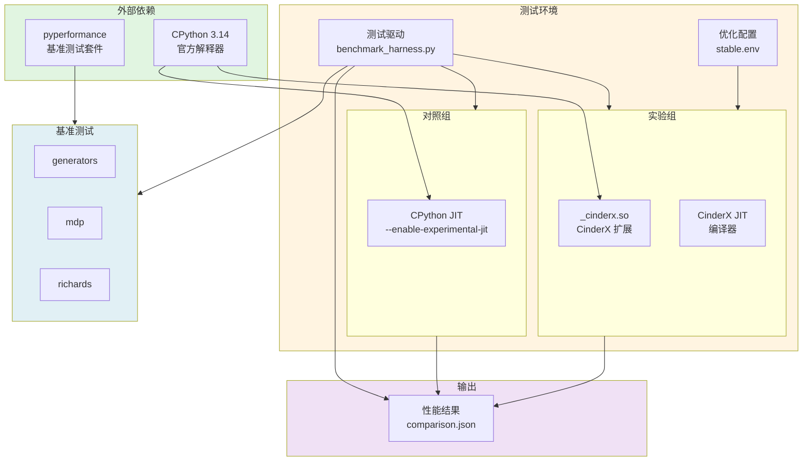

# CinderX 用例视图 - pyperformance 上下文模型（简化版）

## 概述

本文档展示 CinderX 与 pyperformance 基准测试套件集成的简化上下文模型，聚焦核心组件和关键交互。

## 简化上下文模型图



## 核心组件说明

| 组件 | 角色 | 说明 |
| --- | --- | --- |
| **pyperformance** | 测试来源 | Python 官方基准测试套件 |
| **CPython 3.14** | 基础平台 | Python 解释器基础 |
| **对照组** | 性能基线 | 标准 CPython JIT |
| **实验组** | 优化验证 | CinderX JIT + 优化配置 |
| **测试驱动** | 流程编排 | 自动化测试流程 |
| **优化配置** | 参数控制 | JIT 优化开关 |
| **基准测试** | 测试负载 | generators、mdp、richards 等 |
| **性能结果** | 输出产物 | 对比分析报告 |

## 测试流程


## 关键接口

### 环境变量配置

```bash
# JIT 控制
PYTHONJIT=1                    # 启用 JIT
PYTHONJITAUTO=50               # 自动 JIT 阈值

# 优化开关
PYTHONJIT_ARM_GENERATOR_NONE_TRUTHY=1      # generators 优化
PYTHONJIT_ARM_MDP_INT_CLAMP_MIN_MAX=1      # mdp 优化
```

### 测试命令

```bash
# 运行对比测试
BENCHMARK=mdp \
OPT_ENV_FILE=/scripts/configs/mdp/stable.env \
SAMPLES=5 \
WARMUP=1 \
/scripts/test-comparison.sh
```

## 性能指标

| 指标 | 计算方式 | 说明 |
| --- | --- | --- |
| **speedup_cinderx** | baseline / cinderx_baseline | CinderX 加速比 |
| **speedup_optimized** | baseline / cinderx_optimized | 优化后加速比 |
| **optimization_benefit** | cinderx_baseline / cinderx_optimized | 优化收益 |

## 结果示例

```json
{
  "baseline": 0.035727,
  "cinderx_baseline": 0.067485,
  "cinderx_optimized": 0.066685,
  "speedup_cinderx": 0.53,
  "speedup_optimized": 0.54,
  "optimization_benefit": 1.012
}
```

## 核心特征

1. **标准化测试** - 使用 Python 官方基准测试
2. **容器化环境** - Docker 隔离测试环境
3. **配置驱动** - 环境变量控制优化
4. **三层对比** - baseline → CinderX → optimized
5. **自动化流程** - 一键运行完整测试

## 相关文档

- [完整版上下文模型](context-model-pyperformance.md)
- [运行模型](runtime-model.md)
- [部署模型](deployment-model.md)
