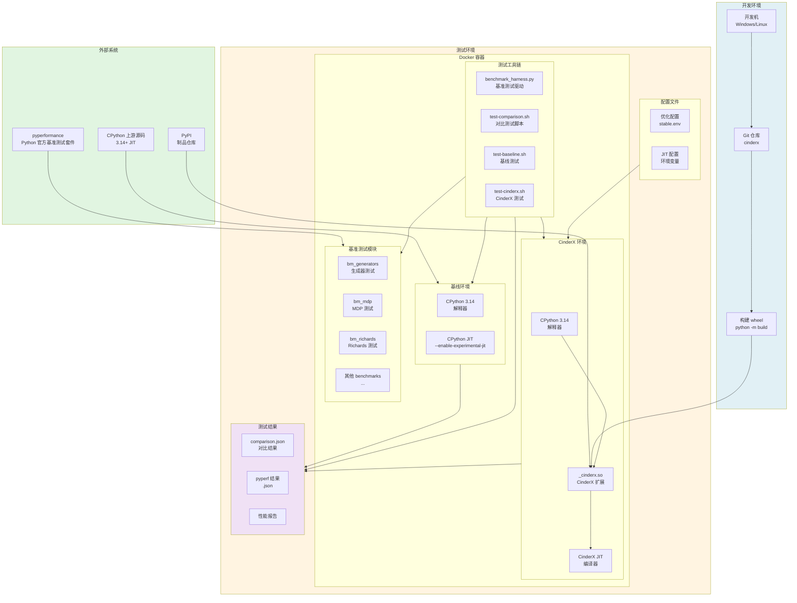
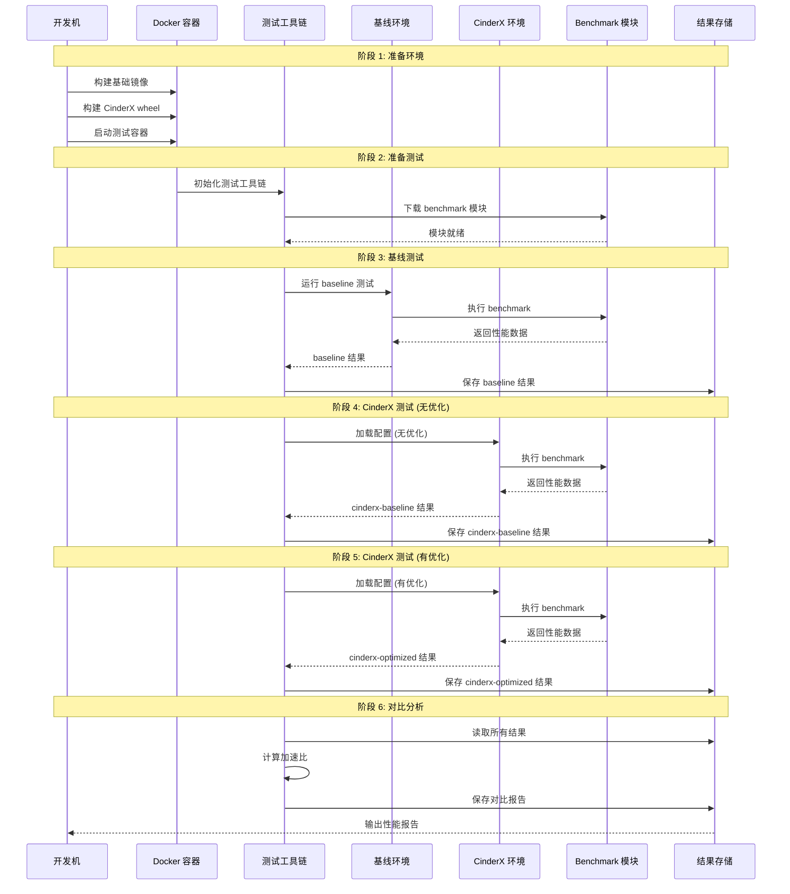
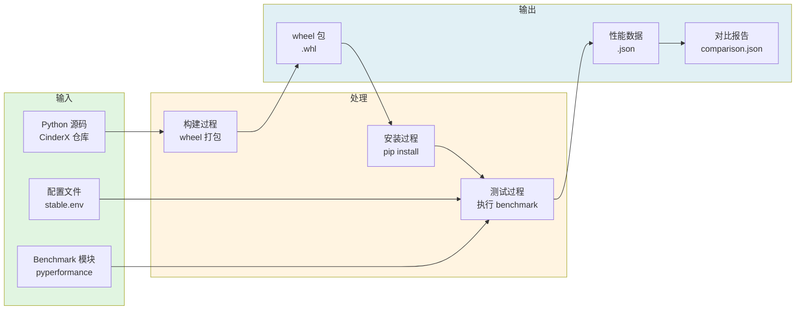
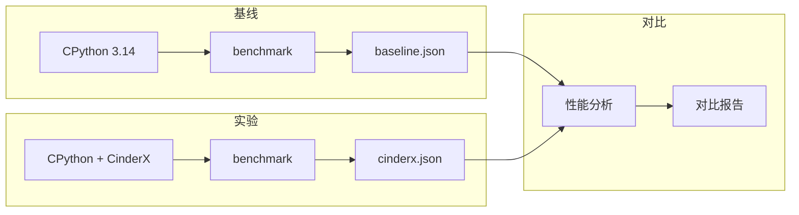
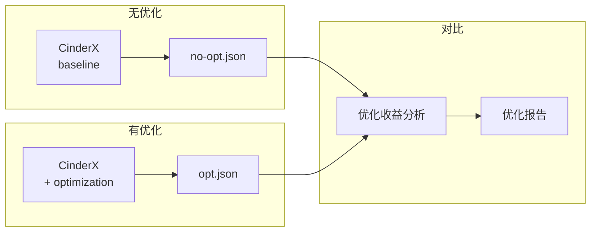
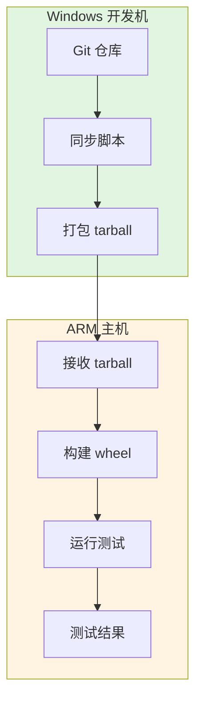

# CinderX 用例视图 - pyperformance 上下文模型

## 概述

本文档描述 CinderX 与 pyperformance 基准测试套件的上下文模型，展示性能测试场景中各组件的关系、数据流和交互机制。

## 上下文模型图



## 上下文边界说明

### 外部系统

| 系统 | 角色 | 交互方式 |
| --- | --- | --- |
| **pyperformance** | Python 官方基准测试套件 | 提供 benchmark 模块、测试框架 |
| **CPython 上游源码** | 基线 Python 实现 | 用于构建 stock CPython JIT |
| **PyPI** | 制品仓库 | 分发 CinderX wheel |

### 测试环境

| 组件 | 角色 | 说明 |
| --- | --- | --- |
| **基线环境** | 对照组 | 标准 CPython 3.14 + JIT |
| **CinderX 环境** | 实验组 | CPython 3.14 + CinderX 扩展 |
| **测试工具链** | 测试驱动 | 编排测试流程、收集结果 |
| **基准测试模块** | 测试负载 | 来自 pyperformance 的 benchmark |
| **配置文件** | 参数控制 | JIT 开关、优化配置 |
| **测试结果** | 输出产物 | 性能数据、对比报告 |

### 开发环境

| 组件 | 角色 | 说明 |
| --- | --- | --- |
| **开发机** | 构建源 | Windows/Linux 开发环境 |
| **Git 仓库** | 代码源 | CinderX 源码 |
| **构建 wheel** | 构建产物 | 可安装的 wheel 包 |

## 数据流模型

### 完整测试流程



### 数据对象流



## 关键接口

### 1. pyperformance 集成接口

```python
# 查找 pyperformance benchmark 模块
from pathlib import Path
import os

def find_pyperformance_benchmark(module_dir: str) -> Path | None:
    candidates: list[Path] = []
    
    # 方式 1: 环境变量
    for env_name in ("PYPERFORMANCE_ROOT", "PYPERF_ROOT", "PY_PERFORMANCE_ROOT"):
        root = os.environ.get(env_name)
        if root:
            root_path = Path(root)
            candidates.append(
                root_path / "pyperformance" / "data-files" / "benchmarks" / module_dir / "run_benchmark.py"
            )
    
    # 方式 2: 已安装的包
    try:
        import pyperformance
        pkg_root = Path(pyperformance.__file__).resolve().parent
        candidates.append(
            pkg_root / "data-files" / "benchmarks" / module_dir / "run_benchmark.py"
        )
    except ImportError:
        pass
    
    # 方式 3: 默认路径
    home = Path.home()
    candidates.append(
        home / "Repo" / "pyperformance" / "pyperformance" / "data-files" / "benchmarks" / module_dir / "run_benchmark.py"
    )
    
    for path in candidates:
        if path.exists():
            return path
    return None
```

### 2. JIT 配置接口

```python
# JIT 启用和配置
import cinderx.jit as jit

# 启用 JIT
jit.enable()

# 配置热点阈值
jit.compile_after_n_calls(1000000)

# 启用专用操作码
jit.enable_specialized_opcodes()

# 强制编译特定函数
jit.force_compile(my_function)

# 获取运行时统计
stats = jit.get_and_clear_runtime_stats()
```

### 3. 环境变量接口

| 环境变量 | 说明 | 示例值 |
| --- | --- | --- |
| `PYTHONJIT` | 启用 JIT | `1` |
| `PYTHONJITAUTO` | 自动 JIT 阈值 | `50` |
| `PYTHONJITLISTFILE` | JIT 列表文件 | `/tmp/jitlist.txt` |
| `PYTHONJITDISABLE` | 禁用 JIT | `1` |
| `PYTHONJIT_ARM_GENERATOR_NONE_TRUTHY` | generators 优化 | `1` |
| `PYTHONJIT_ARM_MDP_INT_CLAMP_MIN_MAX` | mdp 优化 | `1` |
| `CINDERX_ENABLE_SPECIALIZED_OPCODES` | 启用专用操作码 | `1` |

## Benchmark 配置

### 支持的 Benchmark

| Benchmark | 模块目录 | 测试函数 | 优化配置 |
| --- | --- | --- | --- |
| **generators** | `bm_generators` | `bench_generators` | `PYTHONJIT_ARM_GENERATOR_NONE_TRUTHY=1` |
| **mdp** | `bm_mdp` | `bench_mdp` | `PYTHONJIT_ARM_MDP_*` 系列配置 |
| **richards** | `bm_richards` | `bench_richards` | - |

### 配置文件结构

```
docker/cpython-baseline/configs/
├── generators/
│   └── stable.env          # generators 优化配置
└── mdp/
    └── stable.env          # mdp 优化配置
```

### 配置文件示例

**generators/stable.env:**
```bash
PYTHONJIT_ARM_GENERATOR_NONE_TRUTHY=1
```

**mdp/stable.env:**
```bash
PYTHONJIT_ARM_MDP_INT_CLAMP_MIN_MAX=1
PYTHONJIT_ARM_MDP_FRACTION_MIN_COMPARE=1
PYTHONJIT_ARM_MDP_PRIORITY_COMPARE_ADD=1
```

## 测试场景

### 场景 1: 基线对比测试

**目标**: 对比 CPython baseline vs CinderX



**测试命令:**
```bash
docker compose -p mdp-round3 exec cpython-baseline sh -lc \
  'BENCHMARK=mdp OPT_ENV_FILE=/scripts/configs/mdp/stable.env SAMPLES=5 WARMUP=1 /scripts/test-comparison.sh'
```

### 场景 2: 优化效果验证

**目标**: 验证特定优化对性能的影响



**优化收益计算:**
```python
speedup_vs_cinderx = cinderx_baseline / cinderx_optimized
delta_vs_cinderx = (speedup_vs_cinderx - 1.0) * 100
print(f"Optimization benefit: {speedup_vs_cinderx:.4f}x ({delta_vs_cinderx:+.2f}%)")
```

### 场景 3: ARM 平台验证

**目标**: 在 ARM 平台上验证 JIT 功能



**ARM 测试流程:**
```bash
# 1. 构建 wheel
python -m build --wheel

# 2. 安装到 venv
python -m venv /root/venv-cinderx
. /root/venv-cinderx/bin/activate
pip install /root/work/cinderx-main/dist/cinderx-*-linux_aarch64.whl

# 3. 运行 pyperformance
pip install pyperformance
PYTHONJIT=1 PYTHONJITAUTO=50 \
  python -m pyperformance run --debug-single-value -b richards \
    --inherit-environ PYTHONJIT,PYTHONJITAUTO \
    -o /root/work/richards_autojit50_debug.json
```

## 结果输出

### 结果文件结构

```
results/
├── generators/
│   ├── baseline/
│   │   └── comparison.json
│   └── stable/
│       └── comparison.json
└── mdp/
    ├── baseline/
    │   └── comparison.json
    └── stable/
        └── comparison.json
```

### 结果数据格式

**comparison.json:**
```json
{
  "timestamp": "2026-04-08T10:30:00",
  "samples": 10,
  "warmup": 3,
  "baseline": 0.035727,
  "cinderx_baseline": 0.067485,
  "cinderx_optimized": 0.066685,
  "speedup_cinderx": 0.5293,
  "speedup_cinderx_optimized": 0.5357
}
```

### 性能指标

| 指标 | 计算方式 | 说明 |
| --- | --- | --- |
| **baseline** | - | CPython 基线时间 |
| **cinderx_baseline** | - | CinderX 无优化时间 |
| **cinderx_optimized** | - | CinderX 有优化时间 |
| **speedup_cinderx** | baseline / cinderx_baseline | CinderX 相对基线的加速比 |
| **speedup_cinderx_optimized** | baseline / cinderx_optimized | 优化后相对基线的加速比 |
| **optimization_benefit** | cinderx_baseline / cinderx_optimized | 优化的收益 |

## 上下文模型特征总结

CinderX 与 pyperformance 的上下文模型具有以下特征：

1. **标准化测试**: 使用 Python 官方基准测试套件，确保测试的权威性和可比性
2. **容器化环境**: Docker 容器提供隔离、可复现的测试环境
3. **配置驱动**: 通过配置文件控制优化开关，便于实验管理
4. **分层对比**: baseline → CinderX → optimized 三层对比，清晰展示各层收益
5. **多平台支持**: 支持 x86_64 和 ARM64 平台测试
6. **自动化流程**: 从构建到测试到报告生成，全流程自动化
7. **结果持久化**: 结构化的 JSON 结果存储，便于历史对比和趋势分析

## 相关文档

- [运行模型](runtime-model.md) - JIT 运行机制详解
- [部署模型](deployment-model.md) - 部署流程详解
- [代码模型](code-model-diagram.md) - 代码结构详解
- [ARM JIT Guide](../../arm_jit_guide.md) - ARM 平台指南
