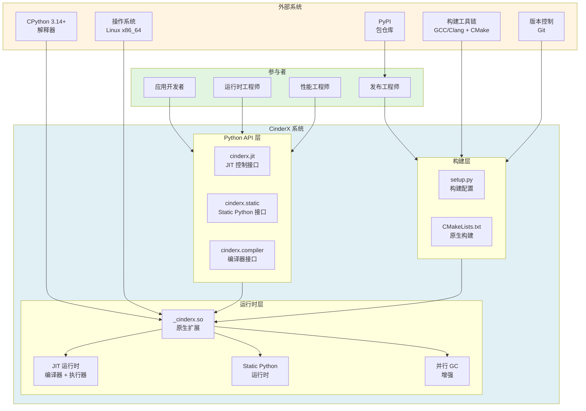

# CinderX 用例视图 - 上下文模型

## 概述

本文档描述 CinderX 系统的上下文模型，展示系统边界、外部参与者、外部系统以及它们之间的交互关系。

## 上下文模型图



## 系统边界

### CinderX 系统职责

CinderX 是一个 Python 运行时性能优化扩展系统，主要职责包括：

1. **JIT 编译** - 将 Python 字节码编译为本地机器码
2. **Static Python** - 基于类型注解的静态优化
3. **运行时增强** - 并行 GC、轻量帧、缓存属性等
4. **多版本适配** - 支持多个 Python 版本

### 系统边界定义

| 边界 | 内部（CinderX） | 外部 |
| --- | --- | --- |
| **代码** | cinderx/ 目录下的所有代码 | CPython 源码、第三方库 |
| **运行时** | _cinderx.so 扩展模块 | CPython 解释器进程 |
| **接口** | Python API (cinderx.jit 等) | 用户 Python 代码 |
| **构建** | setup.py, CMakeLists.txt | GCC/Clang, CMake, setuptools |

## 外部参与者

### 应用开发者

**角色**: 使用 CinderX 优化 Python 应用性能

**需求**:
- 简单易用的 API
- 透明的性能提升
- 兼容现有代码

**交互**:
```python
import cinderx
from cinderx import jit

# 启用 JIT
jit.enable()

# 运行应用
run_my_app()
```

### 运行时工程师

**角色**: 集成和调优 CinderX 运行时

**需求**:
- 精细的控制能力
- 详细的统计信息
- 调试和诊断工具

**交互**:
```python
import cinderx.jit as jit

# 配置 JIT
jit.compile_after_n_calls(100)
jit.enable_specialized_opcodes()

# 强制编译
jit.force_compile(critical_function)

# 获取统计信息
stats = jit.get_and_clear_runtime_stats()
```

### 性能工程师

**角色**: 使用基准测试验证性能提升

**需求**:
- 标准化测试流程
- 可靠的性能数据
- 对比分析工具

**交互**:
```bash
# 运行基准测试
python -m pyperformance run -b richards \
  --inherit-environ PYTHONJIT,PYTHONJITAUTO
```

### 发布工程师

**角色**: 构建和发布 CinderX wheel

**需求**:
- 可复现的构建
- 多平台支持
- 自动化流程

**交互**:
```bash
# 构建 wheel
python -m build --wheel

# 使用 cibuildwheel 构建多平台
cibuildwheel --platform linux
```

## 外部系统

### CPython 3.14+

**角色**: Python 解释器基础平台

**接口**:
- PEP 523 帧执行钩子
- 扩展模块接口
- 对象系统 API
- 内存管理 API

**依赖关系**:
```
CinderX → CPython
  - 加载为扩展模块
  - 使用 CPython API
  - 挂接帧评估器
```

### 操作系统 (Linux x86_64)

**角色**: 运行平台

**接口**:
- 系统调用
- 内存管理
- 线程管理
- 动态链接

**依赖关系**:
```
CinderX → Linux
  - 内存分配 (mmap)
  - 线程创建 (pthread)
  - 代码执行 (mprotect)
```

### 构建工具链

**角色**: 编译和构建 CinderX

**组件**:
- GCC 13+ / Clang (C/C++ 编译器)
- CMake 3.12+ (构建系统)
- setuptools (Python 包构建)
- cibuildwheel (多平台构建)

**依赖关系**:
```
构建工具链 → CinderX
  - 编译 C++ 代码
  - 链接原生库
  - 打包 wheel
```

### PyPI

**角色**: 包分发平台

**接口**:
- wheel 上传
- 包下载
- 版本管理

**依赖关系**:
```
PyPI → 用户
  - pip install cinderx
  
发布工程师 → PyPI
  - twine upload dist/*
```

### 版本控制 (Git)

**角色**: 源码管理

**接口**:
- 代码仓库
- 版本历史
- 分支管理

**依赖关系**:
```
Git → 开发者
  - git clone
  - git pull
  - git push
```

## 接口定义

### Python API 接口

#### JIT 控制接口

```python
# cinderx.jit 模块
def enable() -> None:
    """启用 JIT 编译"""
    
def disable() -> None:
    """禁用 JIT 编译"""
    
def is_enabled() -> bool:
    """检查 JIT 是否启用"""
    
def compile_after_n_calls(n: int) -> None:
    """设置热点阈值"""
    
def force_compile(func: Callable) -> bool:
    """强制编译函数"""
    
def get_and_clear_runtime_stats() -> dict:
    """获取运行时统计"""
```

#### Static Python 接口

```python
# cinderx.static 模块
def is_enabled() -> bool:
    """检查 Static Python 是否启用"""
```

#### 编译器接口

```python
# cinderx.compiler.static 模块
def compile(source: str, filename: str) -> types.CodeType:
    """编译 Static Python 代码"""
```

### 环境变量接口

| 环境变量 | 类型 | 说明 |
| --- | --- | --- |
| `PYTHONJIT` | bool | 启用/禁用 JIT |
| `PYTHONJITAUTO` | int | 自动 JIT 阈值 |
| `PYTHONJITLISTFILE` | path | JIT 列表文件 |
| `PYTHONJITDEBUG` | bool | 启用调试日志 |
| `PYTHONJITLOGFILE` | path | 日志文件路径 |

### 原生接口

```cpp
// 模块初始化
PyMODINIT_FUNC PyInit__cinderx(void);

// 帧评估器
PyObject* cinderx_eval_frame(PyThreadState* tstate, 
                              PyFrameObject* frame,
                              int throwflag);
```

## 数据流

### 输入数据

| 数据类型 | 来源 | 格式 |
| --- | --- | --- |
| Python 源码 | 应用开发者 | .py 文件 |
| 类型注解 | 应用开发者 | Python 语法 |
| 配置参数 | 运行时工程师 | 环境变量 |
| 构建配置 | 发布工程师 | pyproject.toml |

### 输出数据

| 数据类型 | 目标 | 格式 |
| --- | --- | --- |
| wheel 包 | PyPI | .whl 文件 |
| JIT 机器码 | 内存 | 二进制代码 |
| 统计信息 | 性能工程师 | dict/JSON |
| 日志输出 | 调试 | 文本/文件 |

## 约束条件

### 技术约束

| 约束 | 说明 |
| --- | --- |
| Python 版本 | 必须 3.14+ |
| 平台 | Linux x86_64 (主要), ARM64 (实验) |
| 编译器 | GCC 13+ 或 Clang, 支持 C++20 |
| 内存 | 建议 ≥ 2GB (JIT 编译需要) |

### 运行时约束

| 约束 | 说明 |
| --- | --- |
| 加载方式 | 动态加载共享库 |
| 线程安全 | 支持多线程 |
| 兼容性 | 不破坏 Python 语义 |

### 接口约束

| 约束 | 说明 |
| --- | --- |
| API 稳定性 | Python API 保持向后兼容 |
| 环境变量 | 环境变量名保持稳定 |
| 配置格式 | 配置文件格式保持兼容 |

## 上下文模型特征总结

CinderX 的上下文模型具有以下特征：

1. **扩展式架构** - 作为 CPython 扩展模块嵌入，而非独立服务
2. **多角色支持** - 服务于应用开发者、运行时工程师、性能工程师、发布工程师
3. **标准化接口** - Python API、环境变量、原生接口三层接口
4. **外部依赖清晰** - 依赖 CPython、操作系统、构建工具链、PyPI、Git
5. **边界明确** - 清晰定义系统职责和外部系统职责
6. **数据流清晰** - 明确输入数据和输出数据的来源与去向

## 相关文档

- [运行模型](runtime-model.md) - JIT 运行机制详解
- [部署模型](deployment-model.md) - 部署流程详解
- [代码模型](code-model-diagram.md) - 代码结构详解
- [架构规范](cinderx-architecture-spec-option-a-formal.md) - 完整架构说明
