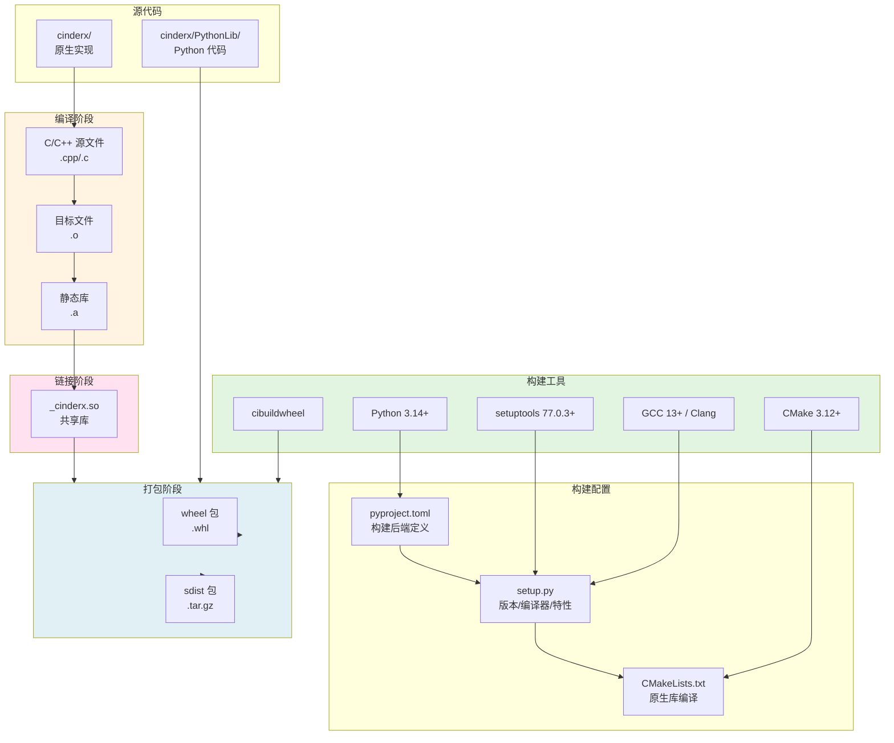
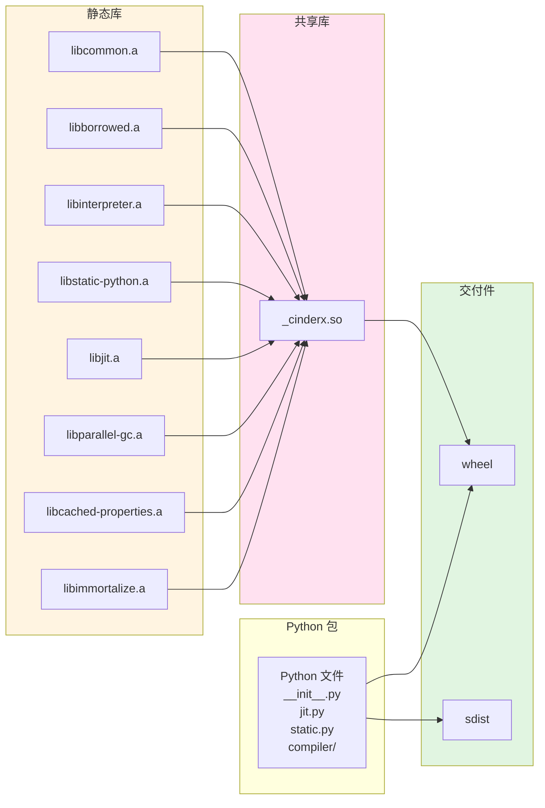

# CinderX 部署视图 - 交付模型图

## 概述

本文档描述 CinderX 项目在 Unix/Linux 平台下的交付模型，重点展示构建产物的构成以及构建工具依赖。

## 构建产物构成

### 主要交付件

| 交付件 | 类型 | 说明 |
| --- | --- | --- |
| **wheel** | 二进制包 | 面向终端安装的主要交付格式 |
| **sdist** | 源码包 | 源码分发包，用于从源码构建 |
| **_cinderx.so** | 共享库 | wheel 中的核心原生扩展 |
| **Python 包文件** | Python 代码 | cinderx/ 目录下的 Python 模块 |

### wheel 包内容结构

```
cinderx-YYYY.MM.DD.PP-py314-none-manylinux_2_28_x86_64.whl
├── _cinderx.so                    # 原生扩展库
├── cinderx/                       # Python 包
│   ├── __init__.py
│   ├── jit.py                     # JIT API
│   ├── static.py                  # Static Python API
│   ├── compiler/                  # 编译器前端
│   │   ├── static/
│   │   └── strict/
│   └── opcodes/                   # 字节码定义
└── cinderx-YYYY.MM.DD.PP.dist-info/
    ├── METADATA
    ├── WHEEL
    └── RECORD
```

### _cinderx.so 组成

原生扩展库由以下模块静态链接而成：

| 模块 | 库文件 | 功能 |
| --- | --- | --- |
| JIT | libjit.a | JIT 编译器（HIR/LIR/代码生成） |
| Static Python | libstatic-python.a | 静态类型运行时 |
| Interpreter | libinterpreter.a | 解释器适配层 |
| Common | libcommon.a | 公共工具函数 |
| Borrowed | libborrowed.a | 从 CPython 借用的代码 |
| Parallel GC | libparallel-gc.a | 并行垃圾回收 |
| Cached Properties | libcached-properties.a | 缓存属性支持 |
| Immortalize | libimmortalize.a | 对象永生化支持 |

## 构建工具依赖

### 核心构建工具

| 工具 | 版本要求 | 用途 |
| --- | --- | --- |
| **Python** | ≥ 3.14 | 构建环境、运行时依赖 |
| **GCC** | ≥ 13 | C/C++ 编译器（推荐） |
| **Clang** | 任意版本 | C/C++ 编译器（备选） |
| **CMake** | ≥ 3.12 | 原生库构建系统 |
| **setuptools** | ≥ 77.0.3 | Python 包构建后端 |
| **cibuildwheel** | 最新版 | wheel 构建矩阵 |

### 编译器要求

```
GCC ≥ 13 或 Clang（支持 C++20 标准）
```

编译器必须支持：
- C++20 标准
- LTO（链接时优化）
- PGO（性能引导优化）

### 系统工具

| 工具 | 用途 |
| --- | --- |
| ar | 静态库打包 |
| ld | 链接器 |
| make | 构建工具 |
| strip | 符号剥离（可选） |

### 可选工具

| 工具 | 用途 |
| --- | --- |
| llvm-ar | Clang LTO 需要的归档工具 |
| Docker | 构建环境隔离、benchmark 测试 |
| perf | 性能分析（Linux） |

## 构建流程图



## 构建产物依赖关系



## 构建特性

### 编译特性开关

| 特性 | CMake 选项 | 说明 |
| --- | --- | --- |
| Static Python | ENABLE_STATIC_PYTHON | 静态类型支持 |
| Adaptive Static Python | ENABLE_ADAPTIVE_STATIC_PYTHON | 自适应静态类型 |
| Parallel GC | ENABLE_PARALLEL_GC | 并行垃圾回收 |
| Lightweight Frames | ENABLE_LIGHTWEIGHT_FRAMES | 轻量级栈帧 |
| Disassembler | ENABLE_DISASSEMBLER | 反汇编支持 |
| Symbolizer | ENABLE_SYMBOLIZER | 符号化支持 |

### 优化选项

| 优化类型 | 环境变量 | 说明 |
| --- | --- | --- |
| PGO | CINDERX_ENABLE_PGO=1 | 性能引导优化 |
| LTO | CINDERX_ENABLE_LTO=1 | 链接时优化 |

### 目标平台

| 平台 | 架构 | Python 版本 |
| --- | --- | --- |
| manylinux_2_28 | x86_64 | 3.14+ |
| musllinux_1_2 | x86_64 | 3.14+ |

## 构建命令

### 本地构建

```bash
# 安装构建依赖
pip install setuptools cibuildwheel

# 构建 wheel
python -m build --wheel

# 构建 sdist
python -m build --sdist
```

### 使用 cibuildwheel 构建

```bash
# 构建所有目标平台的 wheel
cibuildwheel --platform linux

# 构建特定平台
cibuildwheel --platform linux --build-identifiers cp314-manylinux_x86_64
```

### 启用优化构建

```bash
# 启用 PGO 和 LTO
export CINDERX_ENABLE_PGO=1
export CINDERX_ENABLE_LTO=1
python -m build --wheel
```

## 构建环境要求

### manylinux 环境

- 基础镜像: `quay.io/pypa/manylinux_2_28:latest`
- glibc ≥ 2.28
- 包含 GCC 工具链

### musllinux 环境

- 基础镜像: `quay.io/pypa/musllinux_1_2:latest`
- musl libc ≥ 1.2
- 包含 Clang 工具链

## 交付模型总结

CinderX 的交付模型具有以下特征：

1. **分层构建**: pyproject.toml → setup.py → CMake 三层构建配置
2. **模块化链接**: 多个原生子库静态链接为单一扩展载体
3. **标准化交付**: 以 wheel 为主要交付格式，符合 Python 生态规范
4. **性能优化**: 支持 PGO 和 LTO 优化，提升运行时性能
5. **跨平台发布**: cibuildwheel 实现多平台 wheel 构建
