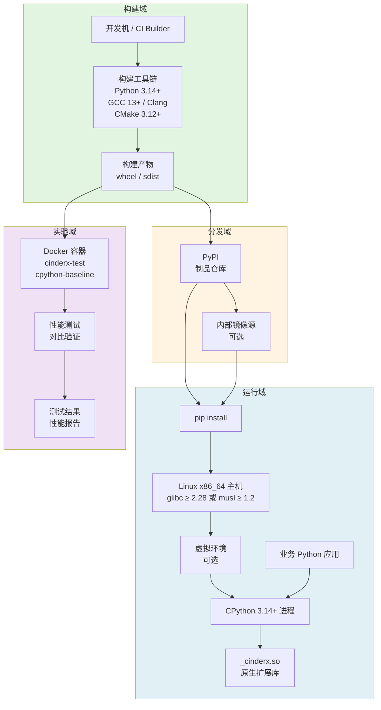
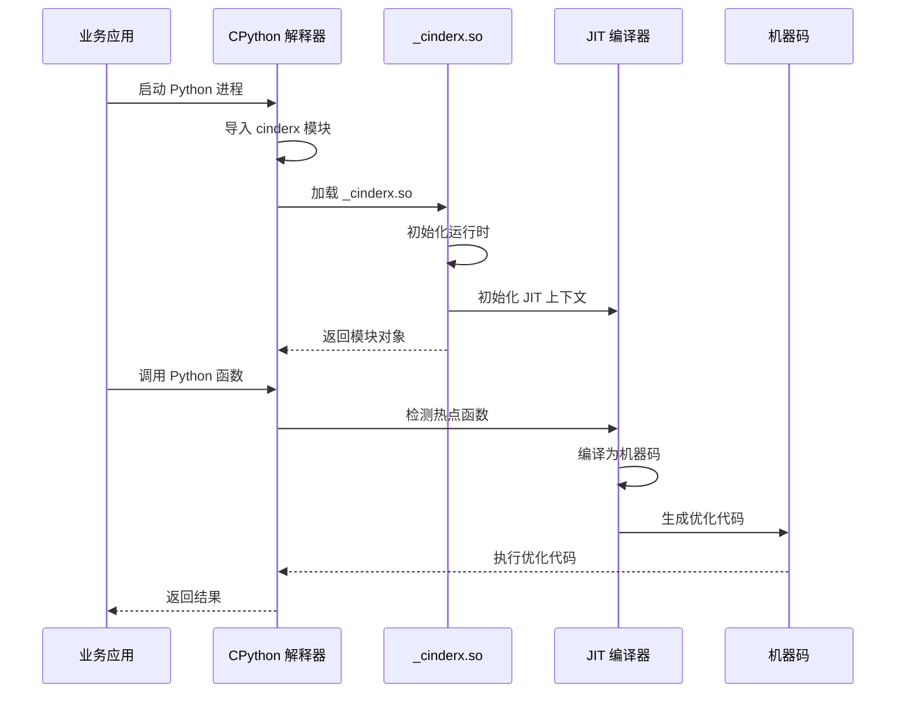
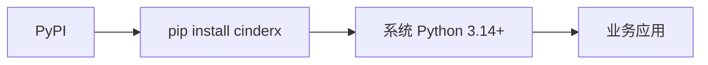
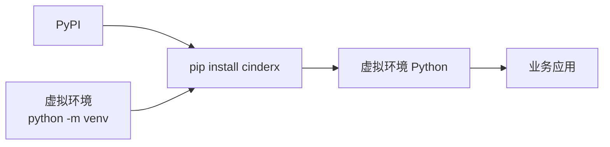
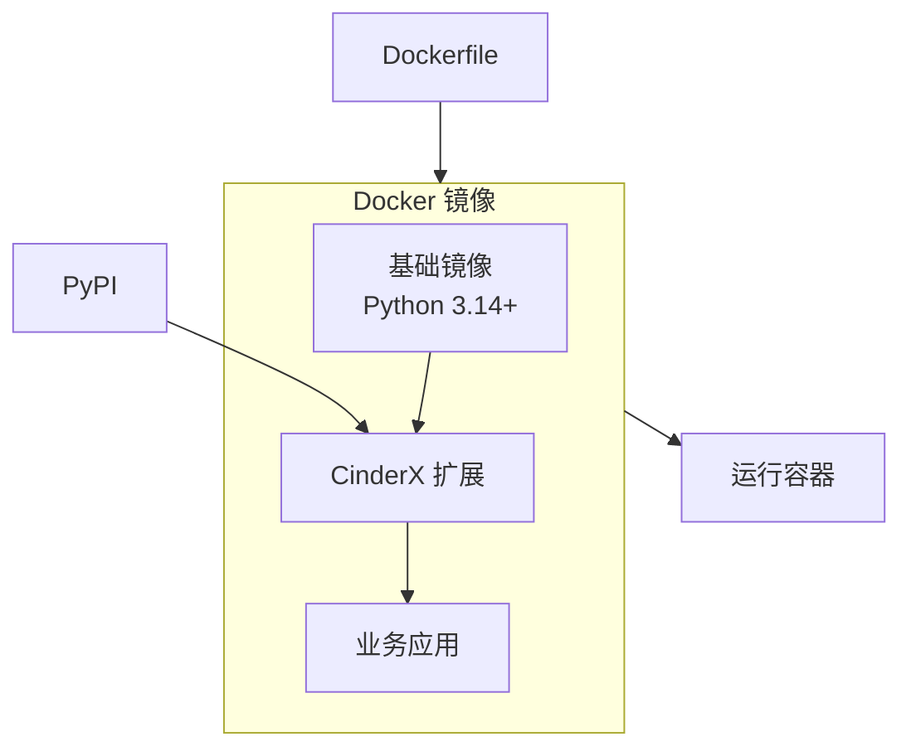
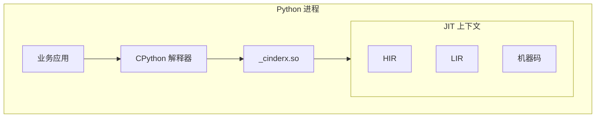
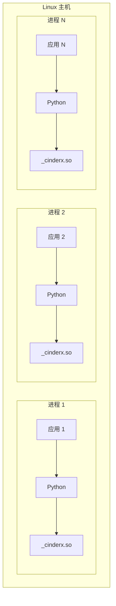

# CinderX 部署视图 - 部署模型图

## 概述

本文档描述 CinderX 项目在 Linux 平台下的部署模型，展示从构建到运行时加载的完整部署流程。

## 部署模型图



## 部署流程详解

### 1. 构建域

构建域负责生成可部署的构建产物。

| 组件 | 说明 |
| --- | --- |
| **开发机 / CI Builder** | 执行构建的机器，可以是开发者的本地机器或 CI/CD 系统 |
| **构建工具链** | Python 3.14+、GCC 13+ 或 Clang、CMake 3.12+ 等构建工具 |
| **构建产物** | wheel 包和 sdist 源码包 |

### 2. 分发域

分发域负责存储和传播构建产物。

| 组件 | 说明 |
| --- | --- |
| **PyPI** | Python 官方包索引，主要的分发渠道 |
| **内部镜像源** | 企业内部 PyPI 镜像，加速下载（可选） |

### 3. 运行域

运行域是 CinderX 实际运行的环境。

| 组件 | 说明 |
| --- | --- |
| **Linux x86_64 主机** | 目标运行机器，需要 glibc ≥ 2.28 或 musl ≥ 1.2 |
| **pip install** | 包管理工具，安装 CinderX |
| **虚拟环境** | Python 虚拟环境，隔离项目依赖（可选） |
| **CPython 进程** | Python 解释器进程，加载 CinderX 扩展 |
| **_cinderx.so** | 原生扩展库，嵌入到 Python 进程中 |
| **业务应用** | 使用 CinderX 的 Python 业务代码 |

### 4. 实验域

实验域用于性能测试和对比验证。

| 组件 | 说明 |
| --- | --- |
| **Docker 容器** | 标准化的测试环境，包括 cinderx-test 和 cpython-baseline |
| **性能测试** | 运行 benchmark 脚本，对比 CinderX 和 CPython 的性能 |
| **测试结果** | 性能报告、回归分析结果 |

## 运行时加载流程



## 部署模式

### 模式一：直接安装

最简单的部署模式，直接在系统 Python 环境中安装。



**适用场景**:
- 开发环境
- 测试环境
- 容器化部署

### 模式二：虚拟环境安装

使用虚拟环境隔离项目依赖。



**适用场景**:
- 生产环境
- 多项目共存
- 依赖隔离

### 模式三：Docker 容器部署

使用 Docker 容器进行标准化部署。



**适用场景**:
- 云原生部署
- Kubernetes 集群
- 标准化环境

## 部署架构

### 单进程架构

CinderX 以共享库形式嵌入单个 Python 进程。



### 多进程架构

多个 Python 进程独立加载 CinderX。



## 部署约束

### 系统要求

| 要求 | 说明 |
| --- | --- |
| **操作系统** | Linux x86_64 |
| **C 标准库** | glibc ≥ 2.28 或 musl ≥ 1.2 |
| **Python 版本** | 3.14+ |
| **内存** | 建议 ≥ 2GB（JIT 编译需要额外内存） |

### 运行时约束

| 约束 | 说明 |
| --- | --- |
| **加载方式** | 动态加载共享库到 Python 进程 |
| **线程安全** | 支持多线程，JIT 编译有线程池 |
| **内存管理** | 遵循 Python 的引用计数和 GC 机制 |

### 兼容性

| 平台 | 支持状态 |
| --- | --- |
| manylinux_2_28 x86_64 | ✅ 完全支持 |
| musllinux_1_2 x86_64 | ✅ 完全支持 |
| ARM64 | 🔬 实验性支持 |

## 部署命令示例

### 安装命令

```bash
# 从 PyPI 安装
pip install cinderx

# 从内部镜像源安装
pip install -i https://internal.pypi.org/simple cinderx

# 从本地 wheel 安装
pip install cinderx-2026.04.02.00-py314-none-manylinux_2_28_x86_64.whl
```

### 验证安装

```bash
# 验证安装
python -c "import cinderx; print(cinderx.__version__)"

# 检查 JIT 状态
python -c "import cinderx.jit as jit; print(jit.is_enabled())"

# 检查 Static Python 状态
python -c "import cinderx.static as static; print(static.is_enabled())"
```

### Docker 部署示例

```dockerfile
FROM python:3.14-slim

RUN pip install cinderx

COPY app /app
WORKDIR /app

CMD ["python", "main.py"]
```

## 部署模型特征总结

CinderX 的部署模型具有以下特征：

1. **库型部署**: 不是独立服务，而是嵌入 Python 进程的扩展库
2. **标准化安装**: 通过 pip 和 wheel 实现标准化安装流程
3. **环境隔离**: 支持虚拟环境和容器化部署
4. **性能验证**: 提供 Docker 环境用于性能对比测试
5. **多进程独立**: 每个进程独立加载，无进程间共享状态
