# CinderX 运行视图 - 运行模型图

## 概述

本文档详细描述 CinderX 的运行模型，重点展示 CinderX 与 CPython 解释器的关系，以及运行时的各种执行路径和交互机制。

## CinderX 与 CPython 解释器的关系

### 整体架构关系

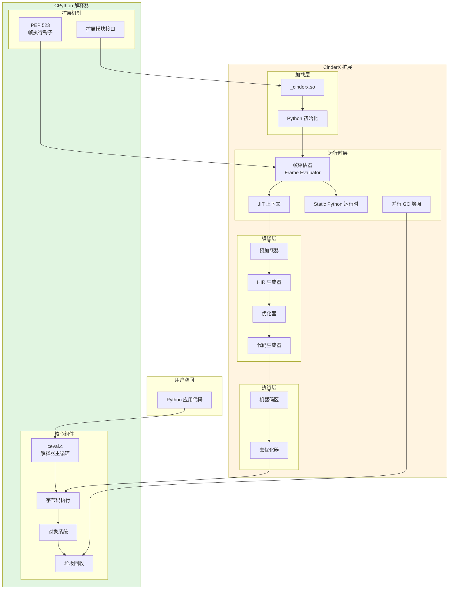

### 关键集成点

| 集成点 | 机制 | 说明 |
| --- | --- | --- |
| **PEP 523 钩子** | `_PyInterpreterFrame` 替换 | CinderX 替换 CPython 的帧评估函数 |
| **扩展模块** | `_cinderx.so` | 标准 Python 扩展模块接口 |
| **解释器循环** | `Interpreter/<version>/` | 覆盖 CPython 的解释器主循环 |
| **对象系统** | 直接调用 CPython API | 操作 Python 对象 |
| **GC 增强** | 可选并行 GC | 增强垃圾回收性能 |

## 运行模型详解

### 1. 进程启动与初始化

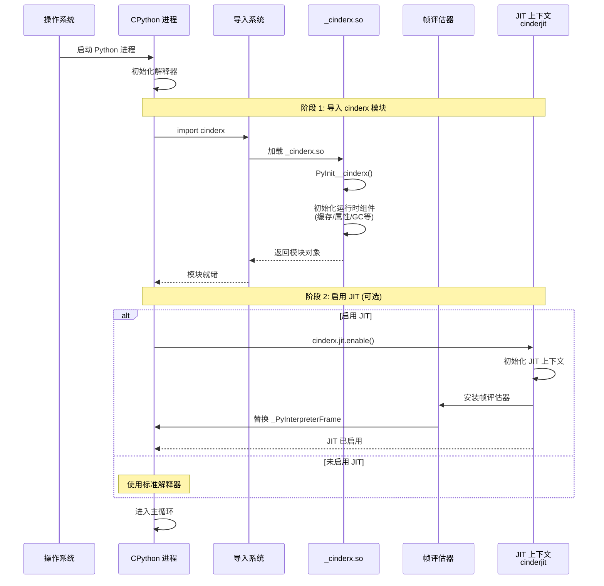

### 初始化阶段说明

| 阶段 | 触发条件 | 动作 |
| --- | --- | --- |
| **模块加载** | `import cinderx` | 加载 `_cinderx.so`，初始化运行时组件 |
| **JIT 启用** | `cinderx.jit.enable()` | 初始化 JIT 上下文，安装帧评估器 |
| **帧评估器安装** | `install_frame_evaluator()` | 替换 CPython 的帧评估函数 |

### JIT 启用条件

JIT 不会在 `import cinderx` 时自动启用，需要满足以下条件：

1. **导入 cinderjit 模块**: JIT 功能由 `cinderjit` 模块提供
2. **调用 enable()**: 显式调用 `cinderx.jit.enable()` 启用 JIT
3. **安装帧评估器**: 通过 `install_frame_evaluator()` 替换 CPython 的帧评估函数

```python
import cinderx

# 检查 JIT 是否可用
try:
    from cinderx import jit
    # 启用 JIT
    jit.enable()
    print("JIT 已启用")
except ImportError:
    print("JIT 不可用")
```

### 2. 帧评估器替换机制

#### PEP 523 钩子机制

PEP 523 提供了在 CPython 3.11+ 中替换帧评估函数的能力。CinderX 利用这个机制来拦截函数调用。

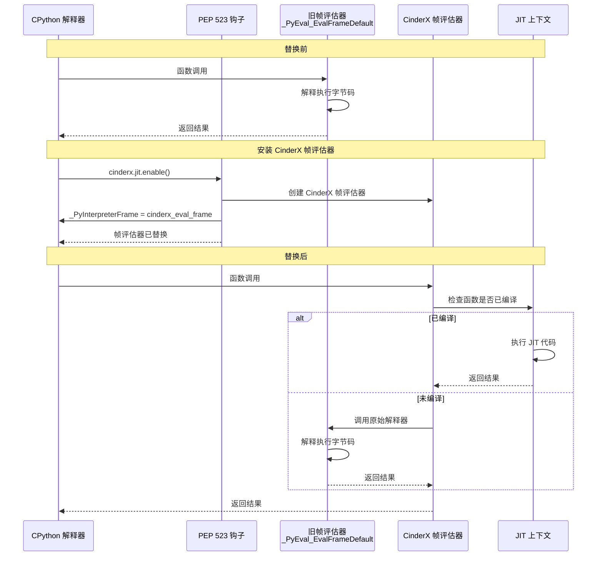

#### 帧评估器替换过程

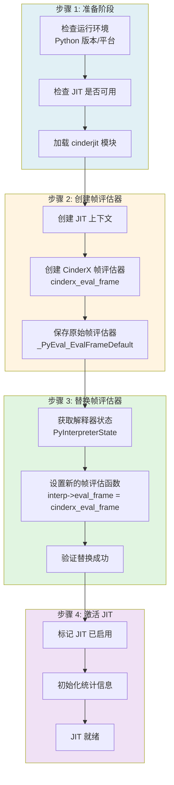

#### 替换前后对比

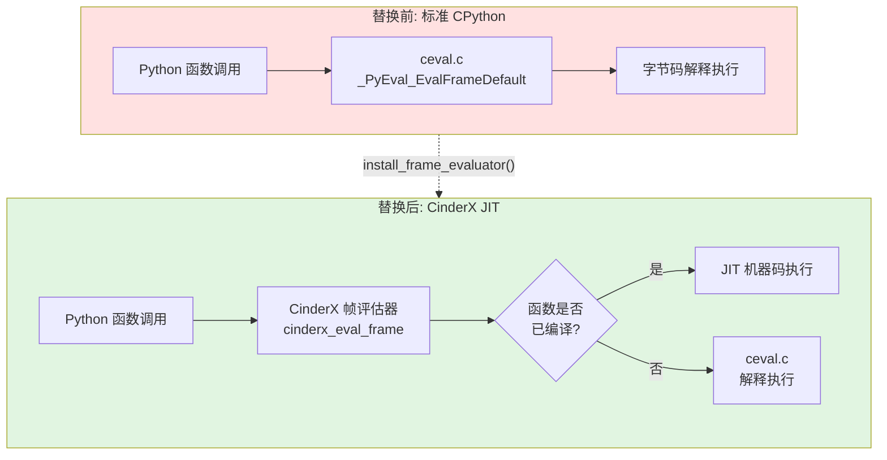

#### 关键代码位置

| 组件 | 文件位置 | 说明 |
| --- | --- | --- |
| **帧评估器安装** | `_cinderx-lib.cpp` | `install_frame_evaluator()` 函数 |
| **JIT 上下文初始化** | `Jit/pyjit.cpp` | JIT 上下文创建和管理 |
| **帧评估函数** | `Jit/` | CinderX 自定义的帧评估逻辑 |
| **PEP 523 接口** | CPython API | `_PyInterpreterFrame` 替换接口 |

## 解释执行与 JIT 执行的完整循环

这是运行模型的核心图，展示了从解释执行进入 JIT 路径，以及通过去优化回退到解释执行的完整循环。

**前提条件**: JIT 已通过 `cinderx.jit.enable()` 启用，帧评估器已安装。

```mermaid
flowchart TB
    subgraph Entry["函数调用入口"]
        start([函数调用])
        check_jit{JIT 已启用?}
        check_compiled{函数已编译?}
        
        start --> check_jit
        check_jit -->|否| interp_path["解释执行路径"]
        check_jit -->|是| check_compiled
        check_compiled -->|是| jit_entry["JIT 入口"]
        check_compiled -->|否| interp_path
    end

    subgraph InterpreterPath["解释执行路径"]
        fetch["取字节码"]
        decode["解码指令"]
        dispatch["分派处理"]
        exec_interp["执行操作"]
        inc_counter["函数调用计数 +1"]
        
        interp_path --> fetch --> decode --> dispatch --> exec_interp --> inc_counter
    end

    subgraph HotPath["热点检测"]
        check_hot{调用次数<br/>≥ 阈值?}
        mark_hot["标记为热点函数"]
        
        inc_counter --> check_hot
        check_hot -->|否| done_interp([返回结果])
        check_hot -->|是| mark_hot
    end

    subgraph JITCompile["JIT 编译流程"]
        trigger["触发编译<br/>后台线程"]
        preload["预加载<br/>全局变量/类型"]
        build_hir["构建 HIR"]
        optimize["优化 passes"]
        lower_lir["降级到 LIR"]
        regalloc["寄存器分配"]
        codegen["生成机器码"]
        register["注册 JIT 入口"]
        
        mark_hot --> trigger
        trigger --> preload
        preload --> build_hir
        build_hir --> optimize
        optimize --> lower_lir
        lower_lir --> regalloc
        regalloc --> codegen
        codegen --> register
        register --> done_compile([编译完成<br/>下次调用使用 JIT])
    end

    subgraph JITExec["JIT 执行路径"]
        jit_entry --> call_jit["调用 JIT 入口"]
        call_jit --> exec_machine["执行机器码"]
    end

    subgraph GuardCheck["假设检查"]
        guard{运行时假设<br/>是否成立?}
        guard_success["继续执行"]
        
        exec_machine --> guard
        guard -->|成立| guard_success
        guard_success --> exec_machine
    end

    subgraph Deoptimization["去优化流程"]
        guard_fail["假设失败"]
        save_state["保存当前状态<br/>寄存器/栈/PC"]
        rebuild_frame["重建解释器帧<br/>PyFrameObject"]
        restore_vars["恢复变量值"]
        update_stack["更新调用栈"]
        return_interp["返回解释器"]
        
        guard -->|失败| guard_fail
        guard_fail --> save_state
        save_state --> rebuild_frame
        rebuild_frame --> restore_vars
        restore_vars --> update_stack
        update_stack --> return_interp
        return_interp --> fetch
    end

    subgraph Result["执行结果"]
        done([返回结果])
        
        guard_success --> done
        done_interp --> done
    end

    style Entry fill:#e1f0f5
    style InterpreterPath fill:#ffe1e1
    style HotPath fill:#fff4e1
    style JITCompile fill:#e1f5e1
    style JITExec fill:#e1f0f5
    style GuardCheck fill:#f0e1f5
    style Deoptimization fill:#ffe1f0
```

### 关键转换点说明

| 转换点 | 触发条件 | 动作 |
| --- | --- | --- |
| **解释 → JIT 编译** | 调用次数达到阈值 | 标记热点，触发编译 |
| **编译完成 → JIT 执行** | JIT 入口注册成功 | 下次调用直接执行机器码 |
| **JIT 执行 → 去优化** | 运行时假设失败 | 保存状态，重建帧 |
| **去优化 → 解释执行** | 状态恢复完成 | 继续解释执行 |

### 去优化触发场景

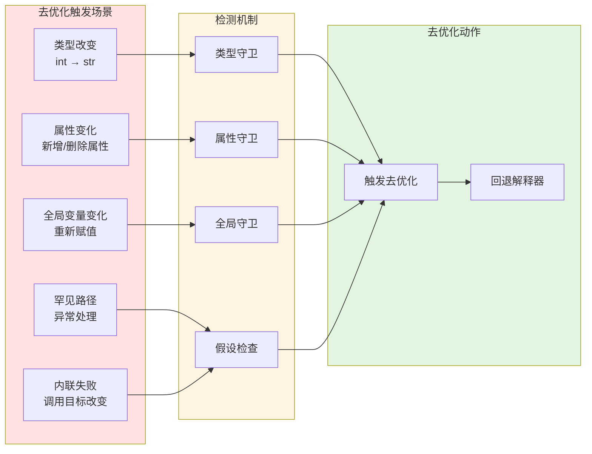

### 状态保存与恢复

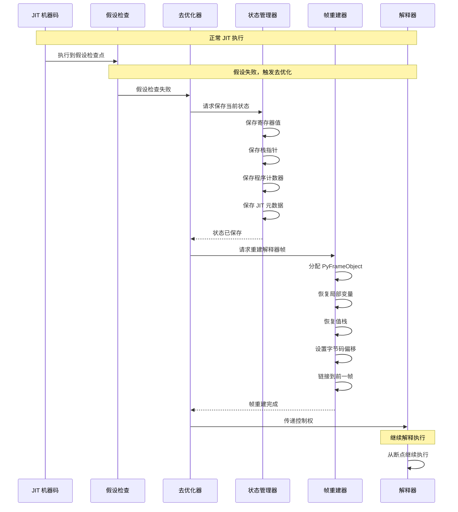

### JIT 入口替换机制

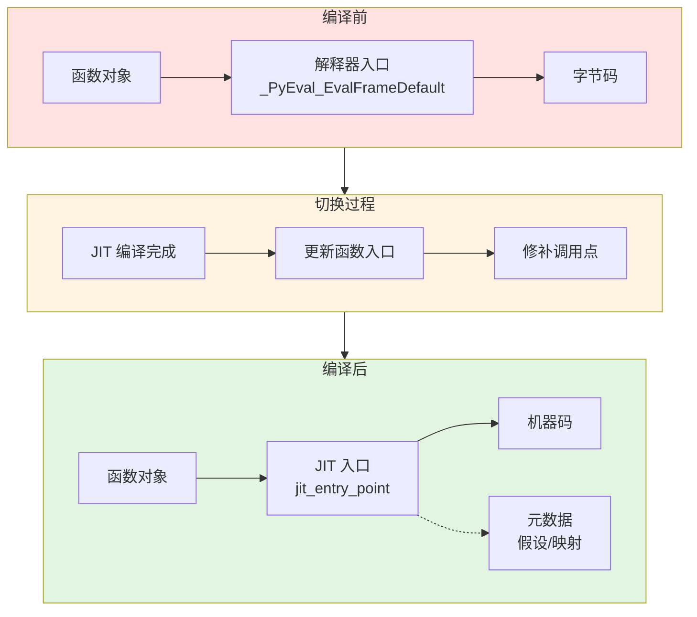

### 3. 函数执行流程

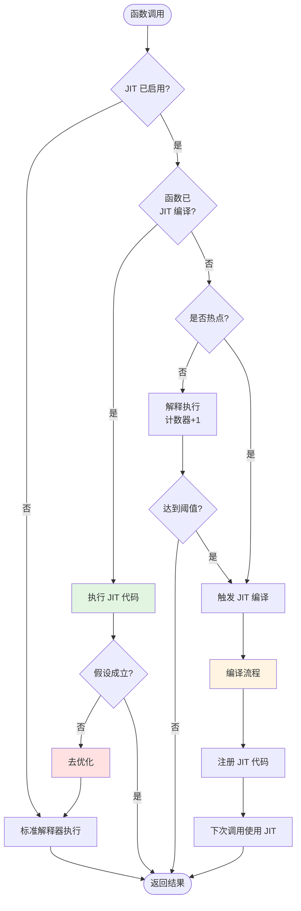

### 4. JIT 编译流程

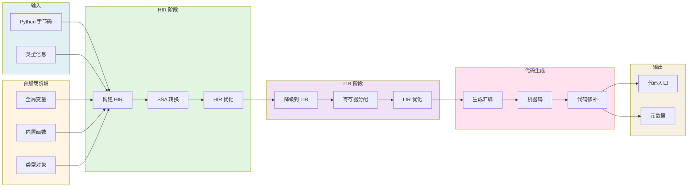

### 5. 解释执行 vs JIT 执行

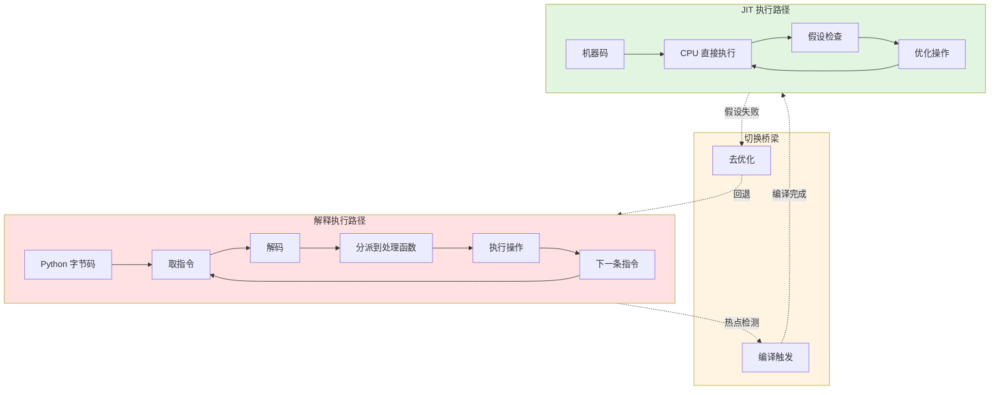

### 6. 去优化机制

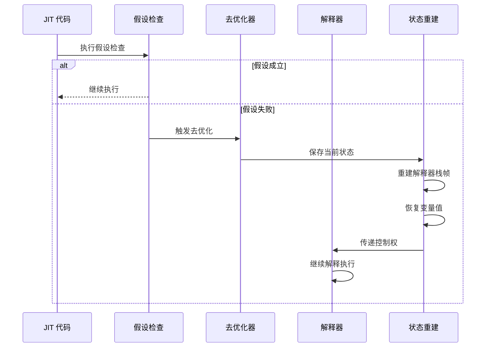

### 7. Static Python 执行路径

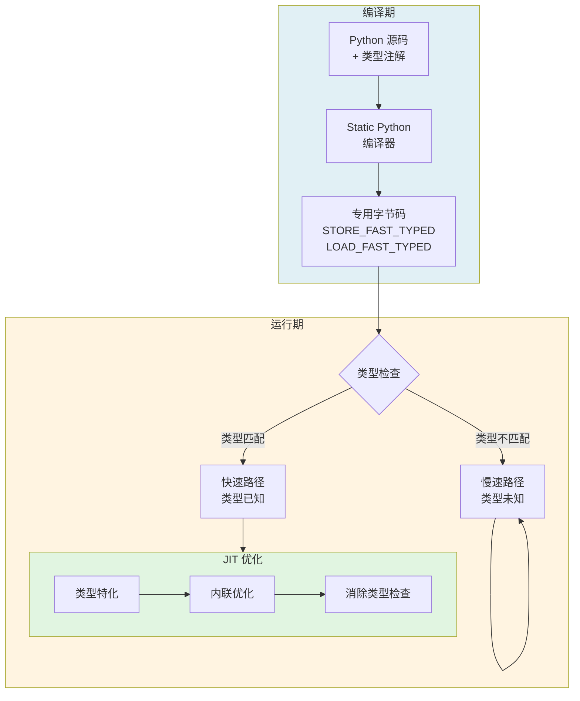

## 运行时组件交互

### 完整运行时架构

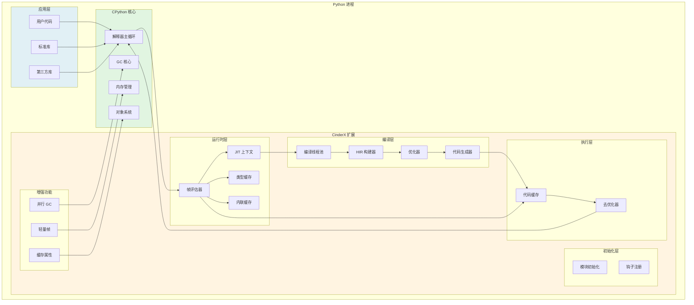

## 执行模式对比

### 三种执行模式

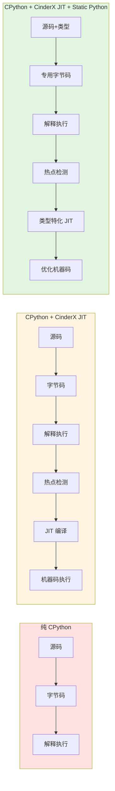

### 性能对比

| 执行模式 | 相对性能 | 特点 |
| --- | --- | --- |
| **纯 CPython** | 1x | 基准性能，完全兼容 |
| **CinderX JIT** | 2-5x | 热点优化，动态类型 |
| **Static Python + JIT** | 5-10x | 类型特化，最大优化 |

## 关键数据结构

### 帧结构对比

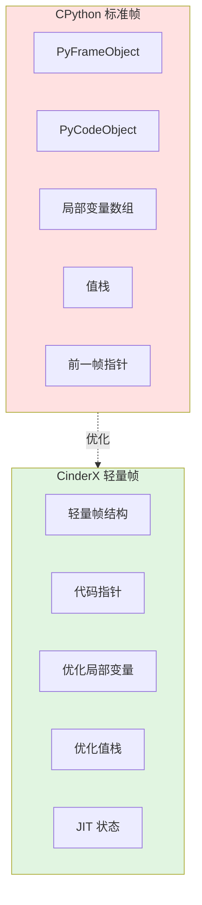

## 运行时配置

### JIT 配置选项

| 配置项 | 说明 | 默认值 |
| --- | --- | --- |
| **JIT 启用** | 是否启用 JIT | True |
| **热点阈值** | 触发编译的调用次数 | 可配置 |
| **编译线程数** | 并发编译线程数 | CPU 核心数 |
| **代码缓存大小** | JIT 代码缓存上限 | 256MB |
| **去优化阈值** | 触发去优化的假设失败次数 | 可配置 |

### 控制接口

```python
import cinderx
from cinderx import jit

# 检查 JIT 是否可用
if jit.is_enabled():
    print("JIT 已启用")

# 启用/禁用 JIT
jit.enable()   # 启用 JIT
jit.disable()  # 禁用 JIT

# 强制编译函数
jit.force_compile(my_function)

# 检查函数是否已编译
if jit.is_jit_compiled(my_function):
    print("函数已编译")

# 获取编译统计信息
stats = jit.get_and_clear_runtime_stats()
print(stats)

# 预编译所有函数
jit.precompile_all()

# 清除 JIT 列表
jit.clear_runtime_stats()
```

### JIT 控制流程

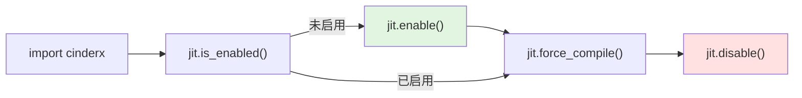

## 运行模型特征总结

CinderX 的运行模型具有以下特征：

1. **非侵入式集成**: 通过 PEP 523 钩子机制，不修改 CPython 源码
2. **透明执行**: 对用户代码完全透明，无需修改
3. **混合执行**: 解释执行和 JIT 执行无缝切换
4. **渐进优化**: 从解释执行逐步优化到 JIT 执行
5. **安全回退**: 去优化机制保证语义正确性
6. **类型特化**: Static Python 提供更强的优化能力
7. **并发编译**: 多线程编译不阻塞主线程
8. **运行时增强**: 并行 GC、轻量帧等增强功能

这种运行模型实现了"解释器的灵活性 + 编译器的性能"的最佳平衡。
